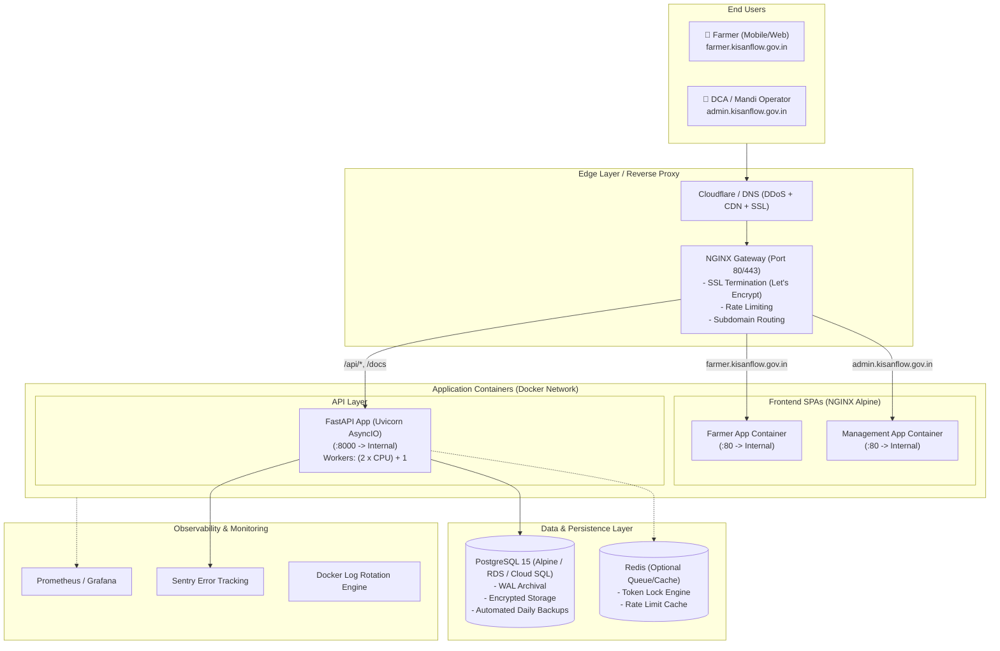

# KisanFlow Production Deployment & Infrastructure Plan

This document outlines the end-to-end strategy, architectural blueprints, and step-by-step procedures for deploying **KisanFlow** across staging and production environments.

---

## 1. System Architecture & Topology



---

## 2. Infrastructure & Hosting Options

| Tier | Target Scale | Recommended Infrastructure | Estimated Cost | Setup Complexity |
| :--- | :--- | :--- | :--- | :--- |
| **Option A (Standard)** | Single Mandi / Pilot Demo (1k - 10k users/day) | Single Cloud VPS (AWS EC2 `t3.large`, DigitalOcean 8GB Droplet, or Hetzner CX31) with Docker Compose | $20 - $45 / month | ⭐ Low (Fastest to launch) |
| **Option B (Managed)** | Multi-District Production (10k - 100k users/day) | Managed App Services: AWS ECS / GCP Cloud Run + AWS RDS PostgreSQL | $120 - $250 / month | ⭐⭐ Moderate |
| **Option C (Enterprise)** | State / National Scale (>100k users/day) | Kubernetes Cluster (EKS / GKE) + Managed HA PostgreSQL + Multi-AZ Load Balancers | $400+ / month | ⭐⭐⭐ High |

---

## 3. Environment Variables & Secret Configuration

Create a secure `.env.production` file on the server (never commit this to Git).

```env
# ==============================================================================
# KisanFlow Production Configuration
# ==============================================================================

# Server Environment
ENVIRONMENT=production
DEBUG=False
PORT=8000

# Security & Authentication
JWT_SECRET_KEY=GENERATE_64_CHAR_HEX_SECRET_KEY_HERE_USE_OPENSSL
JWT_ALGORITHM=HS256
ACCESS_TOKEN_EXPIRE_MINUTES=1440

# Database Configuration (Internal Docker or Managed RDS)
POSTGRES_USER=kisanflow_admin
POSTGRES_PASSWORD=STRONG_PRODUCTION_DB_PASSWORD_HERE
POSTGRES_DB=kisanflow_prod
POSTGRES_HOST=db
POSTGRES_PORT=5432
DATABASE_URL=postgresql+asyncpg://kisanflow_admin:STRONG_PRODUCTION_DB_PASSWORD_HERE@db:5432/kisanflow_prod

# Allowed CORS Origins
FRONTEND_URLS=https://farmer.kisanflow.gov.in,https://admin.kisanflow.gov.in,https://api.kisanflow.gov.in

# SMS / Notification Gateway (Mock / Fast2SMS / Twilio)
SMS_GATEWAY_API_KEY=YOUR_SMS_GATEWAY_API_KEY
SMS_SENDER_ID=KISANF

# Observability
SENTRY_DSN=https://your-dsn@sentry.io/project-id
LOG_LEVEL=INFO
```

---

## 4. Production Docker Architecture

### 4.1 Enhanced `docker-compose.prod.yml`
```yaml
services:
  db:
    image: postgres:15-alpine
    restart: always
    environment:
      POSTGRES_USER: ${POSTGRES_USER}
      POSTGRES_PASSWORD: ${POSTGRES_PASSWORD}
      POSTGRES_DB: ${POSTGRES_DB}
    volumes:
      - postgres_data_prod:/var/lib/postgresql/data
      - ./backups:/backups
    healthcheck:
      test: ["CMD-SHELL", "pg_isready -U ${POSTGRES_USER} -d ${POSTGRES_DB}"]
      interval: 10s
      timeout: 5s
      retries: 5
    networks:
      - kisanflow-internal
    logging:
      driver: "json-file"
      options:
        max-size: "50m"
        max-file: "5"

  backend:
    build:
      context: ./source/backend
      dockerfile: Dockerfile
    restart: always
    env_file:
      - .env.production
    depends_on:
      db:
        condition: service_healthy
    command: >
      sh -c "alembic upgrade head &&
             uvicorn app.main:app --host 0.0.0.0 --port 8000 --workers 4 --proxy-headers --forwarded-allow-ips='*'"
    networks:
      - kisanflow-internal
      - kisanflow-gateway
    logging:
      driver: "json-file"
      options:
        max-size: "50m"
        max-file: "5"

  farmer-app:
    build:
      context: ./source/frontend
      dockerfile: farmer-app/Dockerfile
    restart: always
    networks:
      - kisanflow-gateway
    logging:
      driver: "json-file"
      options:
        max-size: "20m"
        max-file: "3"

  management-app:
    build:
      context: ./source/frontend
      dockerfile: management-app/Dockerfile
    restart: always
    networks:
      - kisanflow-gateway
    logging:
      driver: "json-file"
      options:
        max-size: "20m"
        max-file: "3"

  nginx-proxy:
    image: nginx:alpine
    restart: always
    ports:
      - "80:80"
      - "443:443"
    volumes:
      - ./nginx/prod.conf:/etc/nginx/nginx.conf:ro
      - ./certbot/conf:/etc/letsencrypt:ro
      - ./certbot/www:/var/www/certbot:ro
    depends_on:
      - backend
      - farmer-app
      - management-app
    networks:
      - kisanflow-gateway

volumes:
  postgres_data_prod:

networks:
  kisanflow-internal:
    internal: true
  kisanflow-gateway:
```

---

## 5. NGINX Gateway & SSL Configuration (`nginx/prod.conf`)

```nginx
events {
    worker_connections 2048;
}

http {
    include       mime.types;
    default_type  application/octet-stream;
    sendfile        on;
    keepalive_timeout 65;
    gzip on;
    gzip_types text/plain text/css application/json application/javascript text/xml application/xml text/javascript;

    # Rate limiting zone for API protection
    limit_req_zone $binary_remote_addr zone=api_limit:10m rate=30r/s;

    # HTTP to HTTPS redirect
    server {
        listen 80;
        server_name farmer.kisanflow.gov.in admin.kisanflow.gov.in api.kisanflow.gov.in;
        location /.well-known/acme-challenge/ {
            root /var/www/certbot;
        }
        location / {
            return 301 https://$host$request_uri;
        }
    }

    # 1. API Server (api.kisanflow.gov.in)
    server {
        listen 443 ssl http2;
        server_name api.kisanflow.gov.in;

        ssl_certificate /etc/letsencrypt/live/api.kisanflow.gov.in/fullchain.pem;
        ssl_certificate_key /etc/letsencrypt/live/api.kisanflow.gov.in/privkey.pem;

        location / {
            limit_req zone=api_limit burst=50 nodelay;
            proxy_pass http://backend:8000;
            proxy_set_header Host $host;
            proxy_set_header X-Real-IP $remote_addr;
            proxy_set_header X-Forwarded-For $proxy_add_x_forwarded_for;
            proxy_set_header X-Forwarded-Proto $scheme;
        }
    }

    # 2. Farmer Web App (farmer.kisanflow.gov.in)
    server {
        listen 443 ssl http2;
        server_name farmer.kisanflow.gov.in;

        ssl_certificate /etc/letsencrypt/live/farmer.kisanflow.gov.in/fullchain.pem;
        ssl_certificate_key /etc/letsencrypt/live/farmer.kisanflow.gov.in/privkey.pem;

        location / {
            proxy_pass http://farmer-app:80;
            proxy_set_header Host $host;
            proxy_set_header X-Real-IP $remote_addr;
            proxy_set_header X-Forwarded-For $proxy_add_x_forwarded_for;
        }
    }

    # 3. DCA Management App (admin.kisanflow.gov.in)
    server {
        listen 443 ssl http2;
        server_name admin.kisanflow.gov.in;

        ssl_certificate /etc/letsencrypt/live/admin.kisanflow.gov.in/fullchain.pem;
        ssl_certificate_key /etc/letsencrypt/live/admin.kisanflow.gov.in/privkey.pem;

        location / {
            proxy_pass http://management-app:80;
            proxy_set_header Host $host;
            proxy_set_header X-Real-IP $remote_addr;
            proxy_set_header X-Forwarded-For $proxy_add_x_forwarded_for;
        }
    }
}
```

---

## 6. Step-by-Step Deployment Execution Guide

### Phase 1: Server Provisioning & Pre-requisites
1. Provision an Ubuntu 22.04 LTS VPS (recommended: 4 vCPU, 8GB RAM, 80GB SSD).
2. Install Docker & Docker Compose:
   ```bash
   sudo apt update && sudo apt upgrade -y
   sudo apt install -y curl ufw git
   curl -fsSL https://get.docker.com -o get-docker.sh && sudo sh get-docker.sh
   sudo usermod -aG docker $USER
   ```
3. Configure UFW Firewall:
   ```bash
   sudo ufw allow 22/tcp    # SSH
   sudo ufw allow 80/tcp    # HTTP
   sudo ufw allow 443/tcp   # HTTPS
   sudo ufw enable
   ```

### Phase 2: DNS & Domain Mapping
Configure DNS `A` records pointing to server public IP:
- `farmer.kisanflow.gov.in` ➔ `SERVER_IP`
- `admin.kisanflow.gov.in` ➔ `SERVER_IP`
- `api.kisanflow.gov.in` ➔ `SERVER_IP`

### Phase 3: Project Setup & SSL Issuance
1. Clone codebase to `/var/www/kisanflow`:
   ```bash
   git clone <REPO_URL> /var/www/kisanflow
   cd /var/www/kisanflow
   ```
2. Create `.env.production` with secure values.
3. Issue initial Let's Encrypt certificates using Certbot standalone:
   ```bash
   sudo certbot certonly --standalone -d farmer.kisanflow.gov.in -d admin.kisanflow.gov.in -d api.kisanflow.gov.in
   ```

### Phase 4: Launching Containers
```bash
docker compose -f docker-compose.prod.yml up -d --build
```

### Phase 5: Verification & Smoke Testing
1. Test DB migrations:
   ```bash
   docker compose -f docker-compose.prod.yml exec backend alembic current
   ```
2. Run database healthcheck & test hammer:
   ```bash
   docker compose -f docker-compose.prod.yml exec backend python test_hammer.py
   ```
3. Verify public endpoints via curl or browser:
   - `https://api.kisanflow.gov.in/api/v1/health` ➔ `200 OK`
   - `https://farmer.kisanflow.gov.in` ➔ Loads Farmer Portal
   - `https://admin.kisanflow.gov.in` ➔ Loads DCA Management Portal

---

## 7. Automated Database Backup & Disaster Recovery

Create a cron task for daily encrypted PostgreSQL dumps:
```bash
# /etc/cron.daily/kisanflow-backup
#!/bin/bash
TIMESTAMP=$(date +"%Y%m%d_%H%M%S")
BACKUP_DIR="/var/backups/kisanflow"
mkdir -p $BACKUP_DIR

docker exec kisanflow-production-db-1 pg_dump -U kisanflow_admin kisanflow_prod | gzip > "$BACKUP_DIR/db_backup_$TIMESTAMP.sql.gz"

# Retain last 14 days of backups
find $BACKUP_DIR -type f -name "*.sql.gz" -mtime +14 -exec rm {} +

# Sync to secure AWS S3 bucket (optional)
# aws s3 sync $BACKUP_DIR s3://kisanflow-backups/database/
```
Ensure execution permissions:
```bash
chmod +x /etc/cron.daily/kisanflow-backup
```

---

## 8. CI/CD GitHub Actions Pipeline (`.github/workflows/deploy.yml`)

```yaml
name: KisanFlow CI/CD Pipeline

on:
  push:
    branches: [main]

jobs:
  test:
    runs-on: ubuntu-latest
    steps:
      - uses: actions/checkout@v4
      - name: Set up Python
        uses: actions/setup-python@v5
        with:
          python-version: '3.11'
      - name: Install dependencies
        run: |
          pip install -r source/backend/requirements.txt
      - name: Run Backend Syntax/Lint Checks
        run: |
          python -m compileall source/backend

  deploy:
    needs: test
    runs-on: ubuntu-latest
    if: github.ref == 'refs/heads/main'
    steps:
      - name: SSH Deploy to Production VPS
        uses: appleboy/ssh-action@v1.0.3
        with:
          host: ${{ secrets.PROD_HOST }}
          username: ${{ secrets.PROD_USER }}
          key: ${{ secrets.PROD_SSH_KEY }}
          script: |
            cd /var/www/kisanflow
            git pull origin main
            docker compose -f docker-compose.prod.yml up -d --build
            docker image prune -f
```
