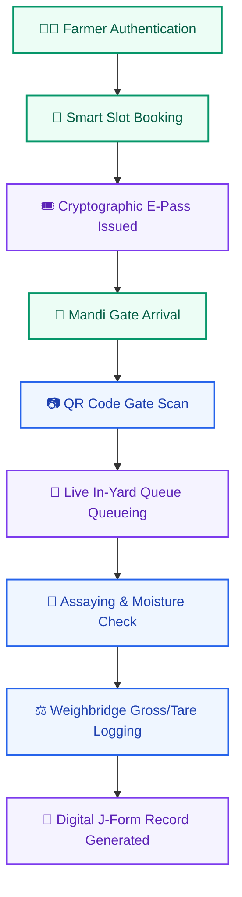
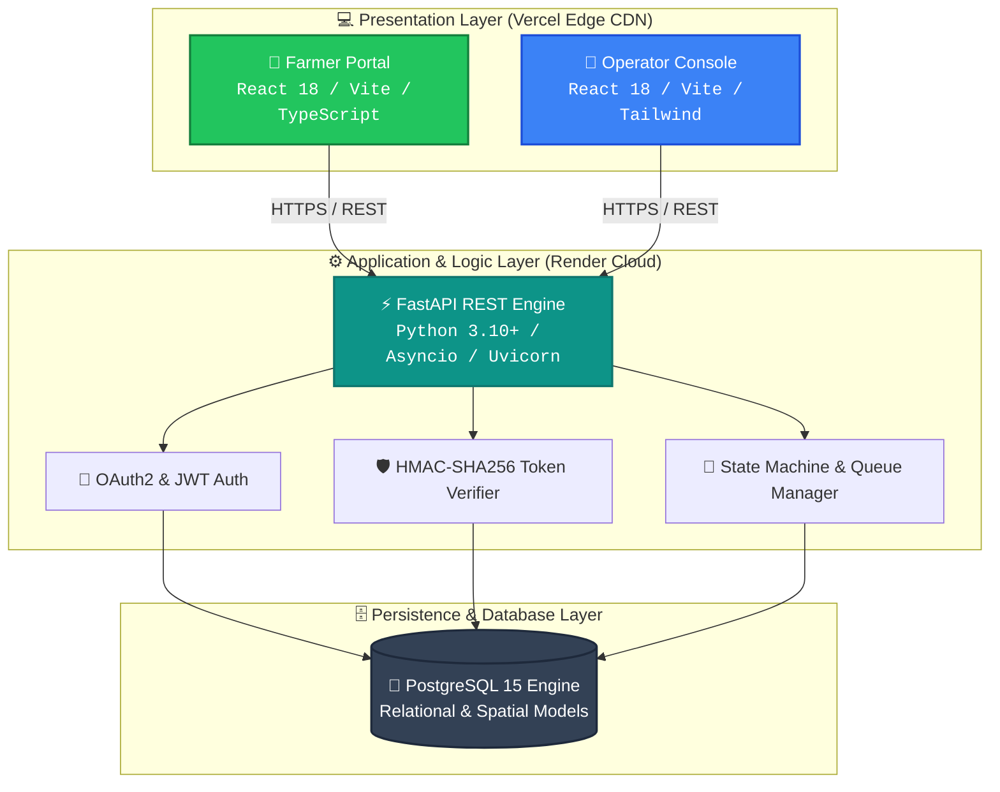

<div align="center">

  # 🌾 COLD CIPHER &mdash; KISANFLOW
  ### Digital Procurement Coordination & Inbound Yard Logistics Platform

  <p align="center">
    <em>Eliminating agricultural procurement gridlock, uncertainty, and physical queue delays for Indian farmers.</em>
  </p>

  <br />

  <!-- Primary Metadata Badges -->
  <a href="https://github.com/mugazhvan/cold-cipher-proc"></a>
  <a href="https://github.com/mugazhvan/cold-cipher-proc"></a>
  <a href="https://github.com/mugazhvan/cold-cipher-proc"></a>
  <a href="https://github.com/mugazhvan/cold-cipher-proc"></a>

  <br />
  <br />

  <!-- Action Buttons -->
  <p align="center">
    <a href="https://management-app-fawn-five.vercel.app/" target="_blank">
      
    </a>
    &nbsp;
    <a href="https://management-app-alpha-six.vercel.app/" target="_blank">
      
    </a>
    &nbsp;
    <a href="https://kisanflow-backend.onrender.com/api/v1/docs" target="_blank">
      
    </a>
    &nbsp;
    <a href="./sih_audit_reports" target="_blank">
      
    </a>
  </p>

</div>

<br />

---

## 📌 1. Project Snapshot

<table width="100%">
  <tr>
    <td width="25%"><strong>🎯 Problem Focus</strong></td>
    <td>Unpredictable procurement schedules leading to massive physical APMC queues, diesel waste, and crop exposure.</td>
  </tr>
  <tr>
    <td><strong>💡 Solution</strong></td>
    <td>A unified digital scheduling, slot-booking, cryptographic token entry, and real-time mandi yard progression platform.</td>
  </tr>
  <tr>
    <td><strong>👥 Target Users</strong></td>
    <td><strong>Farmers</strong> (Schedules & Queue Tracking) &bull; <strong>Mandi Operators</strong> (Yard Ingress, Assaying, Weighbridge).</td>
  </tr>
  <tr>
    <td><strong>🚀 Core Objective</strong></td>
    <td>Transform chaotic physical arrivals into guaranteed deterministic arrival windows with live queue transparency.</td>
  </tr>
  <tr>
    <td><strong>🚦 Prototype Status</strong></td>
    <td><code>🟢 Fully Functional Web Applications & Cloud REST API</code> <em>(Mobile Android builds currently out of public demo scope)</em>.</td>
  </tr>
</table>

<br />

---

## 🔍 2. The Problem Statement

During harvest seasons, agricultural procurement centers and APMC mandis experience acute congestion:

```
[ 🚜 Farmers Arrive Unannounced ] ➔ [ 🛑 Physical Bottleneck at Gate ] ➔ [ ⏳ Multi-Day Lineups & Fuel Waste ] ➔ [ 📉 Crop Spoilage ]
```

- **Schedule Blindspots:** Farmers arrive without knowing center capacity, leading to miles of tractor trailers waiting on highways.
- **Resource Depletion:** Farmers spend days idling in lines, spending excess diesel and missing subsequent farm operations.
- **Asymmetric Information:** Lack of visibility into weighbridge and moisture assaying queues creates confusion and administrative delays.

> [!NOTE]
> **The Logistics Gap:** While platforms like e-NAM solve commodity trading and bidding, **KisanFlow solves the physical inbound yard logistics and arrival coordination** that happens before trading can take place.

<br />

---

## ⚡ 3. Our Solution & Workflow

KisanFlow introduces a synchronous coordination protocol between the farmer and the mandi gate:



<br />

---

## ✨ 4. Key Platform Features

<table>
  <thead>
    <tr>
      <th width="30%">Module / Capability</th>
      <th>Technical Specification & Operational Purpose</th>
      <th width="18%">Verification</th>
    </tr>
  </thead>
  <tbody>
    <tr>
      <td><strong>🔐 Farmer Authentication</strong></td>
      <td>Lightweight OTP-based session management designed for low-friction farmer login.</td>
      <td><code>🟢 IMPLEMENTED</code></td>
    </tr>
    <tr>
      <td><strong>📅 Dynamic Slot Booking</strong></td>
      <td>Calculates available mandi quota by crop tonnage and prevents over-allocation.</td>
      <td><code>🟢 IMPLEMENTED</code></td>
    </tr>
    <tr>
      <td><strong>🎟️ Cryptographic E-Pass (QR)</strong></td>
      <td>Generates offline-verifiable <code>HMAC-SHA256</code> signed tokens to prevent queue forgery.</td>
      <td><code>🟢 IMPLEMENTED</code></td>
    </tr>
    <tr>
      <td><strong>🚦 Live Queue Tracker</strong></td>
      <td>Real-time state progression engine (<code>Booked</code> ➔ <code>In-Yard</code> ➔ <code>Assaying</code> ➔ <code>Weighed</code>).</td>
      <td><code>🟢 IMPLEMENTED</code></td>
    </tr>
    <tr>
      <td><strong>⚙️ Mandi Capacity Engine</strong></td>
      <td>Allows administrators to set dynamic daily throughput limits and gate processing speeds.</td>
      <td><code>🟢 IMPLEMENTED</code></td>
    </tr>
    <tr>
      <td><strong>📊 District Command Console</strong></td>
      <td>Aggregated visibility for District Collectors / Mandi Board into procurement volume.</td>
      <td><code>🟢 IMPLEMENTED</code></td>
    </tr>
    <tr>
      <td><strong>📑 Digital Procurement Records</strong></td>
      <td>Automated digital record generation for moisture parameters, dockage, and weight.</td>
      <td><code>🟢 IMPLEMENTED</code></td>
    </tr>
    <tr>
      <td><strong>📲 SMS & IVR Alerts</strong></td>
      <td>Automated push notifications for slot arrival reminders.</td>
      <td><code>🟡 PLANNED</code></td>
    </tr>
    <tr>
      <td><strong>💳 Live DBT Bank Settlement</strong></td>
      <td>End-to-end PFMS direct benefit bank disbursement integration.</td>
      <td><code>🟡 SIMULATED</code></td>
    </tr>
  </tbody>
</table>

<br />

---

## 🏛️ 5. System Architecture



<br />

---

## 🔄 6. Detailed User Workflows

<details open>
<summary><strong>👨‍🌾 Farmer Journey &bull; Click to expand/collapse</strong></summary>

<br />

```
[1. Login] ➔ [2. Select Mandi & Crop] ➔ [3. Book Time Slot] ➔ [4. Save QR E-Pass] ➔ [5. Arrive & Track Yard Queue]
```

1. **Authentication:** Fast mobile number entry with session persistence.
2. **Radar & Center Discovery:** View nearest procurement centers with live quota status.
3. **Slot Reservation:** Choose an open arrival window suited to transport availability.
4. **Pass Generation:** Instant digital E-Pass generated with QR code.
5. **Real-Time Tracking:** Check live vehicle queue status from the tractor seat while approaching.

</details>

<details open>
<summary><strong>👮‍♂️ Mandi Operator & DCA Journey &bull; Click to expand/collapse</strong></summary>

<br />

```
[1. Operator Login] ➔ [2. Gate Ingress Scan] ➔ [3. Queue Transition] ➔ [4. Record Moisture/Weight] ➔ [5. Finalize Procurement]
```

1. **Gate Ingress:** Scan incoming farmer QR codes to validate arrival against daily capacity.
2. **Yard Routing:** Admitted vehicles move into active queue status automatically.
3. **Quality & Assay:** Log moisture percentage and quality grade.
4. **Weighbridge Operation:** Record gross and tare vehicle weights.
5. **Procurement Finalization:** Generate signed digital receipt and release vehicle.

</details>

<br />

---

## 💻 7. Technology Stack

<p align="center">
  
  
  
  
  <br />
  
  
  
  
</p>

| Component | Technology | Specification & Role |
| :--- | :--- | :--- |
| **Frontend Framework** | `React 18 (Vite SPA)` | Client-side reactive UI with modular component hierarchy. |
| **Styling & Icons** | `Tailwind CSS` + `Lucide React` | High-contrast, mobile-first accessible interface. |
| **Backend Framework** | `FastAPI` + `SQLAlchemy Async` | Asynchronous, non-blocking REST endpoints with OpenAPI specs. |
| **Database Engine** | `PostgreSQL 15` | Relational consistency, foreign key constraints, and spatial indexes. |
| **Cryptographic Layer**| `HMAC-SHA256` + `JWT (Bcrypt)` | Tamper-proof token serialization and secure credential storage. |
| **Testing Framework** | `Pytest` + `HTTPX` | Rigorous state machine, concurrency, and RBAC integration test suite. |
| **Deployment Edge** | `Vercel` (Frontends) + `Render` (API) | Globally distributed CDN edge with continuous integration. |

<br />

---

## 🌐 8. Live Demonstration & Portals

<div align="center">

| Application | Live URL | Access Credentials |
| :--- | :--- | :--- |
| 🌾 **Farmer Portal** | [**management-app-fawn-five.vercel.app**](https://management-app-fawn-five.vercel.app/) | *Open Access / Phone Demo* |
| 👮 **Operator Console** | [**management-app-alpha-six.vercel.app**](https://management-app-alpha-six.vercel.app/) | `operator1` / `password123` |
| 🛡️ **DCA Admin Dashboard**| [**management-app-alpha-six.vercel.app**](https://management-app-alpha-six.vercel.app/) | `admin@kisanflow.gov.in` / `password123` |
| ⚡ **Swagger API Docs** | [**kisanflow-backend.onrender.com/api/v1/docs**](https://kisanflow-backend.onrender.com/api/v1/docs) | *Public Interactive OpenAPI* |

</div>

<br />

---

## 📑 9. Research, Audits & Evaluation Evidence Hub

All claims, architectural patterns, and validation benchmarks are rigorously tracked inside our public documentation hub:

<p align="center">
  <a href="./sih_audit_reports">
    
  </a>
</p>

| Evidence Report | Subject & Focus Area | Direct Link |
| :--- | :--- | :---: |
| 🚀 **Project Quick Start** | Rapid 2-minute architectural and operational briefing. | [**Read Document**](sih_audit_reports/00_EXECUTIVE_OVERVIEW/PROJECT_QUICK_START.md) |
| 🔍 **Master Evidence Index** | Direct traceability mapping between features and source code lines. | [**Read Document**](sih_audit_reports/00_EXECUTIVE_OVERVIEW/EVIDENCE_INDEX.md) |
| 🏛️ **System Architecture** | Comprehensive technical deep dive into backend modules and schemas. | [**Read Document**](sih_audit_reports/03_TECHNICAL_ARCHITECTURE/SYSTEM_ARCHITECTURE.md) |
| 🛡️ **Security Audit** | Formal review of RBAC, IDOR vulnerability tests, and crypto passes. | [**Read Document**](sih_audit_reports/04_SECURITY_AND_PRIVACY/SECURITY_AUDIT.md) |
| 📊 **Impact Analysis** | Quantified reduction of diesel waste and procurement bottlenecks. | [**Read Document**](sih_audit_reports/08_IMPACT/IMPACT_ANALYSIS.md) |
| ⚠️ **Current Limitations** | Transparent accounting of prototype boundaries vs. production goals. | [**Read Document**](sih_audit_reports/11_LIMITATIONS_AND_FUTURE/CURRENT_LIMITATIONS.md) |

<br />

---

## 🧪 10. Automated Validation & Test Suite

The platform logic is enforced by automated test suites in `source/backend/tests`:

```
source/backend/tests/
 ├── test_state_machine.py    # Prevents invalid queue jumps and out-of-order transitions
 ├── test_concurrency.py      # Verifies atomic slot quota reservations under race conditions
 ├── test_rbac_idor.py        # Proves strict role isolation between Farmers, Operators & DCA
 └── test_m10_stress.py       # Validates high-volume request handling under burst loads
```

| Validation Category | Test Suite File | Result | Verified Capability |
| :--- | :--- | :---: | :--- |
| **State Transitions** | `test_state_machine.py` | 🟢 `PASSED` | Enforces single-direction vehicle progression. |
| **Concurrency Locks** | `test_concurrency.py` | 🟢 `PASSED` | Prevents overbooking beyond daily mandi quota. |
| **Security & RBAC** | `test_rbac_idor.py` | 🟢 `PASSED` | Proves farmers cannot inspect or tamper other bookings. |
| **Burst Capacity** | `test_m10_stress.py` | 🟢 `PASSED` | Validates async throughput under simulated mandi peak. |

<br />

---

## 🔒 11. Security, Privacy & Integrity

- **Role-Based Access Control (RBAC):** Strict JWT separation ensures farmers cannot access operator or admin routes.
- **Cryptographic Anti-Tamper E-Passes:** QR payloads are signed with `HMAC-SHA256` keys, preventing fake token generation.
- **Zero Credentials Exposure:** Zero API secrets or credentials committed in version control; environment variables injected dynamically.
- **Password Protection:** Operator and administrative credentials secured with `Bcrypt` multi-round hashing.

<br />

---

## 📈 12. Scalability Architecture

- **Stateless Services:** The FastAPI backend is completely stateless, enabling horizontal scaling across worker nodes.
- **Hierarchical Tenancy:** The data model natively structures Mandis by State, District, Center, and Gate, supporting seamless nationwide rollout.
- **Edge Content Delivery:** Static frontend assets are served via Vercel's global CDN, ensuring millisecond response times even over rural mobile connections.

<br />

---

## ⚠️ 13. Current Limitations

1. **Government Sync:** Direct sync with live e-NAM and PFMS state databases is currently architectural and simulated.
2. **Offline Mode:** The operator app requires active internet connectivity to mutate queue records in the centralized database.
3. **Mobile Builds:** Android Expo native APK builds are currently undergoing build toolchain stabilization and are excluded from this evaluation demo.

<br />

---

## 👥 14. Team & Hackathon Information

<div align="center">

| Project Identity | Details |
| :--- | :--- |
| **Team Name** | **Cold Cipher** |
| **Team ID** | **151660** |
| **Hackathon** | **Smart India Hackathon 2026** |
| **Problem Statement ID** | **SIH26032** |
| **Repository** | [`github.com/mugazhvan/cold-cipher-proc`](https://github.com/mugazhvan/cold-cipher-proc) |

</div>

<br />

---

<div align="center">

  ### 🔗 Quick Navigation

  [](https://management-app-fawn-five.vercel.app/)
  &nbsp;
  [](https://management-app-alpha-six.vercel.app/)
  &nbsp;
  [](https://kisanflow-backend.onrender.com/api/v1/docs)
  &nbsp;
  [](./sih_audit_reports)
  &nbsp;
  [](https://github.com/mugazhvan/cold-cipher-proc)

  <br />
  <br />

  <sub>Cold Cipher &bull; Smart India Hackathon 2026 &bull; Team ID: 151660 &bull; Problem Statement: SIH26032</sub>

</div>
