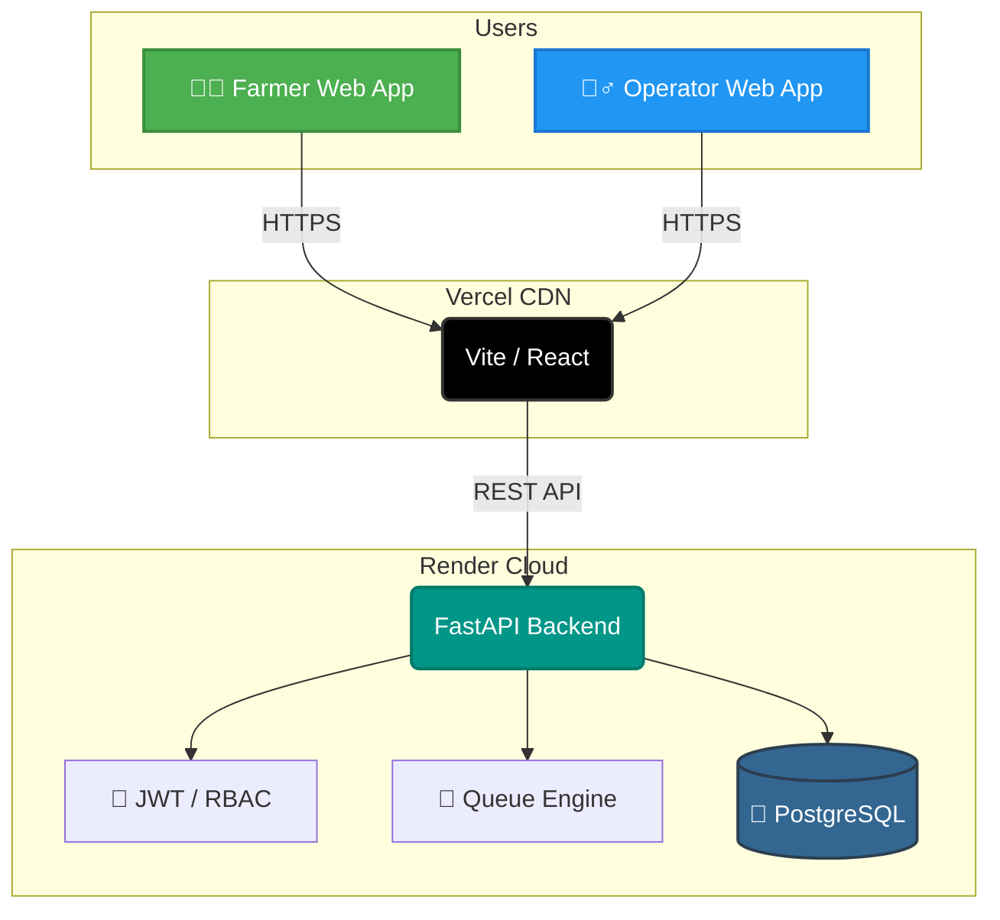

  
  
  
  
   
   

  # 🌾 KisanFlow (किसान प्रवाह)
  
  **A digital procurement coordination platform designed to improve visibility, scheduling, and coordination between farmers and procurement centres.**

 

## 📖 Overview

Every harvest season, farmers face crippling bottlenecks at APMC mandis and state procurement centres. The core issues we are solving include:

- ⏳ **Uncertainty around procurement schedules**, causing farmers to wait in physical lines without knowing when they will be processed.
- ⛽ **Unnecessary waiting**, leading to wasted diesel, lost time, and crop exposure to weather conditions.
- 🌫️ **Lack of queue visibility**, making it difficult to plan the journey from the village to the mandi.
- 📝 **Manual coordination** and fragmentation of status information, which causes confusion at the weighbridge and delays in payments.

**KisanFlow** modernizes this experience by providing a unified, digital coordination layer for both farmers and procurement operators.

 

## 🎯 The Solution & Architecture

KisanFlow digitizes the inbound logistics of agricultural procurement. It provides an end-to-end coordinated workflow powered by a centralized backend.

> [!NOTE]
> KisanFlow focuses strictly on **procurement coordination and logistics** rather than acting as a commodity trading marketplace (which is handled by e-NAM). Financial transfers (DBT) and external government APIs (PFMS/UIDAI) are *simulated* in this prototype to demonstrate the architecture.

 

## 🏗️ Technology & Deployment Stack

We built KisanFlow using modern, scalable, and highly robust technologies.

  
  
  
  
   
  
  
  
  

 

| Layer | Technologies & Tools |
| --- | --- |
| **Frontend Applications** | React 18, Vite, Tailwind CSS, TypeScript, Lucide Icons |
| **Backend API** | Python 3.10+, FastAPI, SQLAlchemy (Async), Uvicorn |
| **Database** | PostgreSQL 15 (Relational Data & Spatial configurations) |
| **Security** | OAuth2 Password Bearer, JWT (Python-Jose), Bcrypt, Cryptographic HMAC-SHA256 tokens |
| **Testing** | Pytest (Stress testing, State Machine validation, Concurrency logic) |
| **Deployment** | Vercel (Frontend CDN), Render (Backend & Database Host) |

 

## 🚀 Live Demo

> [!IMPORTANT]
> The KisanFlow prototype web applications are deployed live. Use the links below to test the platform. *(Note: Mobile Android deployment is not part of this public evaluation scope).*

- 👨‍🌾 **[Open Farmer App](https://management-app-fawn-five.vercel.app/)**
- 👮‍♂️ **[Open Management App](https://management-app-alpha-six.vercel.app/)**
- 💻 **[View Source Code](https://github.com/mugazhvan/cold-cipher-proc)**

#### 🔑 Public Demo Personas
* **Mandi Operator (Admin)**: `operator1` / `password123`
* **DCA Administrator**: `admin@kisanflow.gov.in` / `password123`

 

## 📚 Smart India Hackathon Evidence Hub

To evaluate the project for SIH 2026, please visit our dedicated **Evidence & Documentation Hub**. It contains the comprehensive research, audits, and architectural mapping required by judges.

👉 **[Go to the Evidence & Documentation Hub (sih_audit_reports)](./sih_audit_reports)** 👈

### Key Evaluator Documents:
* 🚀 **[Project Quick Start](sih_audit_reports/00_EXECUTIVE_OVERVIEW/PROJECT_QUICK_START.md)** — Two minute evaluation guide.
* 🔎 **[Master Evidence Index](sih_audit_reports/00_EXECUTIVE_OVERVIEW/EVIDENCE_INDEX.md)** — Trace our features to real codebase implementations and test reports.
* 🏗️ **[System Architecture](sih_audit_reports/03_TECHNICAL_ARCHITECTURE/SYSTEM_ARCHITECTURE.md)** — Detailed backend component breakdown.
* 🔒 **[Security Audit](sih_audit_reports/04_SECURITY_AND_PRIVACY/SECURITY_AUDIT.md)** — RBAC, JWT, and QR Cryptography audits.
* ⚠️ **[Current Limitations](sih_audit_reports/11_LIMITATIONS_AND_FUTURE/CURRENT_LIMITATIONS.md)** — Responsible disclosure of prototype constraints.

---

  <i>Built with purpose by Team Cold Cipher for the Smart India Hackathon 2026.</i>

