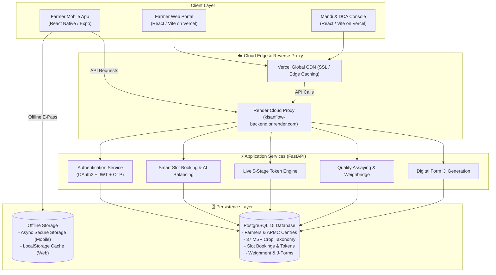

# 🌾 KisanFlow (किसान प्रवाह)
### Next-Generation Decentralized Mandi Slot Booking, Token Queue Optimization & Fair Crop Procurement Platform

[](https://fastapi.tiangolo.com)
[](https://reactjs.org)
[](https://expo.dev)
[](https://www.typescriptlang.org)
[](https://www.postgresql.org)
[](https://www.docker.com)
[](https://vercel.com)
[](https://render.com)
[](LICENSE)

---

## 🌐 Live Prototype Deployments

Experience the live cloud prototype directly without local installation:

| Service / Application | Platform | Live URL | Description |
| :--- | :--- | :--- | :--- |
| **🚜 Farmer Web Portal** | **Vercel** | [**kisanflow-farmer.vercel.app**](https://kisanflow-farmer.vercel.app) | Farmer web portal for interactive slot booking, 360° radar mandi locator, 37 MSP crops, live queue tracking, and digital Form 'J'. *(Alt: [kisanflow-farmer-app.vercel.app](https://kisanflow-farmer-app.vercel.app))* |
| **🏢 Mandi Management & DCA Console** | **Vercel** | [**kisanflow-management.vercel.app**](https://kisanflow-management.vercel.app) | Mandi operator & district agricultural administrator dashboard for real-time queue orchestration, gate check-in, weighbridge logging, and analytics. *(Alt: [kisanflow-admin.vercel.app](https://kisanflow-admin.vercel.app))* |
| **⚡ Backend REST API & Swagger UI** | **Render** | [**kisanflow-backend.onrender.com/docs**](https://kisanflow-backend.onrender.com/docs) | Interactive OpenAPI / Swagger API documentation with live execution of all authentication, booking, queue, and verification endpoints. |
| **📖 ReDoc API Specification** | **Render** | [**kisanflow-backend.onrender.com/redoc**](https://kisanflow-backend.onrender.com/redoc) | Human-readable API documentation and data schema specifications. |
| **📱 Farmer Mobile App (Expo)** | **Expo / EAS** | [**expo.dev/accounts/mugazhv/projects/farmer-mobile**](https://expo.dev/accounts/mugazhv/projects/farmer-mobile) | React Native/Expo mobile app for farmers featuring native SVG radar, camera QR pass, offline cache, and instant push alerts. |
| **🗄️ Managed Cloud Database** | **Render (Singapore)** | `kisanflow-db` (PostgreSQL 15) | Relational persistence engine with connection pooling and WAL backups. |

---

## 🔑 One-Click Demo Credentials

Both the web and mobile applications include **one-click demo login buttons** for instant testing:

* **👨‍🌾 Farmer Persona (Rajesh Kumar)**
  * **Phone / Aadhaar**: `9876543210`
  * **Demo OTP**: `123456`
  * *Features available*: Book Mandi Slots, 360° SVG Radar, 37 Crop Selector, Offline E-Gate Pass with QR, Live Stage Progression, Form 'J' Tax Invoice.

* **👷 Mandi Operator Persona (Amritsar Central APMC)**
  * **Username**: `operator1`
  * **Password**: `password123`
  * *Features available*: High-speed QR Gate Verification, Weighbridge In/Out Entry, Quality Assay Logging (Moisture & Foreign Matter), Token Stage Promotion.

* **🏛️ District Agricultural Officer (DCA Administrator)**
  * **Username**: `admin@kisanflow.gov.in`
  * **Password**: `password123`
  * *Features available*: Multi-centre District Heatmaps, Dynamic Mandi Load Balancing, Influx Prediction, Throughput Analytics.

---

## 🎯 The Problem & The KisanFlow Solution

### The Challenge in Traditional Mandis
Every harvest season, millions of Indian farmers face crippling bottlenecks at Agricultural Produce Market Committees (APMC) and state procurement centres:
* **Severe Traffic & Physical Queueing**: Unscheduled arrivals force tractor-trolleys to queue for 18 to 48 hours outside mandi gates, wasting diesel and risking grain exposure to rain.
* **Distress Selling**: Overwhelmed mandis turn away farmers, leaving them vulnerable to unscrupulous middlemen buying at 30–40% below the Minimum Support Price (MSP).
* **Manual Paperwork & Fraud**: Paper slips, uncalibrated weight receipts, and manual assaying lead to manipulation, ghost farmers, and disputed deductions.
* **Delayed Payments**: Farmers wait weeks for physical Form 'J' generation and reconciliation before receiving Direct Benefit Transfer (DBT) funds.

### The KisanFlow Innovation
KisanFlow digitizes and decentralizes the entire procurement lifecycle:
1. **Dynamic Slot Scheduling**: Farmers book guaranteed unloading windows from their phone or village CSC centre.
2. **360° Native SVG Radar Mandi Locator**: Real-time visual radar showing nearby mandis, current congestion levels, and travel distance calculated using the Haversine formula.
3. **Comprehensive 37 MSP Crop Taxonomy**: Full government-notified crop taxonomy categorized across Cereals, Pulses, Oilseeds, Commercial Crops, Millets, Spices, and Vegetables with bilingual vernacular support.
4. **Cryptographically Signed QR E-Gate Passes**: Secure, tamper-proof gate passes that work offline, instantly verifiable by gate operators with a single scan.
5. **Real-time 5-Stage Token Lifecycle**: Visual end-to-end tracking from booking to payment clearance.
6. **Automated Digital Form 'J'**: Instant, legally compliant digital procurement vouchers with itemized gross weight, tare weight, moisture deductions, and net MSP calculations.

---

## 🏗️ System Architecture & Data Flow



---

## 🔄 The 5-Stage Token Procurement Lifecycle

```mermaid
sequenceDiagram
    autonumber
    actor Farmer as 🚜 Farmer
    participant App as 📱 KisanFlow App
    participant Gate as 🚧 Mandi Ingress Gate
    participant Scale as ⚖️ Weighbridge
    participant Lab as 🔬 Quality Lab
    participant Payout as 💰 DBT / Bank

    Farmer->>App: 1. Selects Crop & Books Guaranteed Slot
    App-->>Farmer: Generates Signed QR E-Gate Pass (Status: BOOKED)
    Farmer->>Gate: 2. Arrives at Mandi; Presents QR Pass
    Gate->>Gate: Scans QR; Verifies Authenticity (Status: ARRIVED)
    Gate->>Scale: 3. Vehicle drives onto Weighbridge (Gross Weight)
    Scale-->>App: Logs Gross Weight (Status: WEIGHBRIDGE_IN)
    Scale->>Lab: 4. Unloads produce & assays moisture/foreign matter
    Lab-->>App: Logs Quality Grade & Allowable Deductions (Status: QUALITY_CHECK)
    Lab->>Scale: 5. Empty vehicle weighs tare weight; Net weight computed
    Scale-->>Payout: Approves procurement voucher (Status: COMPLETED)
    Payout-->>Farmer: Instant Digital Form 'J' issued + DBT Transfer initiated!
```

---

## 💎 Key Features & Technological Innovations

### 1. 360° Native SVG Radar Mandi Locator
* **Custom SVG Rendering**: High-performance, hardware-accelerated radar display showing procurement centres as dynamic radar blips.
* **Status Rings**: Intuitive color-coded congestion indicators (Green = Light Traffic, Amber = Moderate Wait, Red = Congested).
* **Haversine Distance Engine**: Computes spherical distance from the farmer's GPS coordinates to every regional APMC centre in real-time.

### 2. Comprehensive 37 MSP Crop Taxonomy
Full support for the Government of India's notified Minimum Support Price regime across 7 major agricultural categories:
* **Cereals (6)**: Paddy (Common), Paddy (Grade A), Wheat, Maize, Barley, Jowar (Hybrid/Maldandi).
* **Pulses (5)**: Gram (Chana), Tur / Arhar, Moong, Urad, Lentil (Masur).
* **Oilseeds (8)**: Groundnut, Soybean (Yellow), Mustard & Rapeseed, Sunflower Seed, Sesamum, Nigerseed, Safflower, Copra.
* **Commercial & Cash Crops (4)**: Cotton (Medium/Long Staple), Sugarcane (FRP), Raw Jute, Tobacco.
* **Millets / Nutri-Cereals (6)**: Bajra, Ragi (Finger Millet), Proso Millet, Foxtail Millet, Kodo Millet, Barnyard Millet.
* **Spices & Condiments (4)**: Turmeric, Coriander, Cumin (Jeera), Red Chilli.
* **Vegetables & Horticulture (4)**: Potato, Onion, Tomato, Garlic.
* *Includes real-time MSP price floors, FAQ specifications, allowable moisture percentage caps, and foreign matter thresholds.*

### 3. Native & Offline-First E-Gate Pass
* **Signed QR Codes**: Contains cryptographically verified metadata (Farmer ID, Center ID, Slot Time, Vehicle Number, Crop Code).
* **Offline Resilience**: Mobile app caches active gate passes in `AsyncStorage`, enabling farmers to display their pass even without cellular connectivity inside remote mandi yards.

### 4. Digital Form 'J' & Instant Invoicing
* Generates statutory **Form 'J'** sales receipts directly in the app.
* Automatically tabulates:
  $$\text{Net Weight} = \text{Gross Weight} - \text{Tare Weight} - \text{Moisture Deductions}$$
  $$\text{Total Payout} = \text{Net Weight} \times \text{Official MSP Rate}$$
* Includes QR verification stamp and one-click PDF / Print export.

### 5. Multi-Centre Operator & DCA Intelligence
* **Dynamic Gate Throttling**: Automatically adjusts queue throughput based on weighbridge capacity.
* **Inter-Mandi Load Balancing**: Diverts incoming tractor loads from overloaded centres to nearby underutilized APMC mandis within a 25 km radius.

---

## 📁 Repository Directory Structure

```
KisanFlow-Production/
├── docker-compose.yml              # Local multi-container Docker cluster
├── docker-compose.prod.yml         # Production-ready Docker Compose orchestration
├── render.yaml                     # Render Infrastructure-as-Code (FastAPI + PostgreSQL)
├── DEPLOYMENT_PLAN.md              # Production deployment & infrastructure manual
├── MOBILE_DEPLOYMENT_PLAN.md       # Mobile build, testing, and EAS publication guide
├── SYSTEM_ARCHITECTURE_AND_FEATURES.md # Full technical specification & feature manual
│
├── source/
│   ├── backend/                    # Python FastAPI Core API Service
│   │   ├── app/
│   │   │   ├── api/v1/endpoints/   # Auth, bookings, centres, queue, weighbridge, j-forms
│   │   │   ├── core/               # App config, database session, security, JWT
│   │   │   ├── models/             # SQLAlchemy ORM models
│   │   │   ├── schemas/            # Pydantic v2 validation contracts
│   │   │   └── services/           # Queue balancing, QR signing, notification engine
│   │   ├── Dockerfile              # Production Python 3.11 container image
│   │   └── requirements.txt        # Backend dependencies
│   │
│   ├── frontend/                   # Web Applications (React + Vite + Tailwind)
│   │   ├── farmer-app/             # Farmer Web Portal (Vercel)
│   │   │   ├── src/components/     # Radar, slot booking, e-pass modal, Form 'J', token tracker
│   │   │   ├── src/context/        # KisanFlowContext state manager
│   │   │   └── vercel.json         # Vercel deployment configuration
│   │   ├── management-app/         # Mandi Operator & DCA Admin Portal (Vercel)
│   │   │   ├── src/components/     # Gate entry, weighbridge log, assaying, analytics
│   │   │   └── vercel.json         # Vercel deployment configuration
│   │   └── shared/                 # Shared TypeScript types, contracts & mock data
│   │
│   └── mobile/                     # Mobile Applications (React Native + Expo)
│       └── farmer-mobile/          # Farmer Mobile App (Android/iOS via Expo)
│           ├── app/                # Expo Router file-based screens
│           │   ├── (tabs)/         # Dashboard, Radar Mandi Booking, E-Pass, History
│           │   ├── queue/[id].tsx  # Real-time token queue progression
│           │   └── _layout.tsx     # Navigation root
│           ├── src/components/     # Native SVG Radar, vernacular search, crop cards
│           ├── src/context/        # FarmerContext with 37 crops and offline cache
│           ├── app.json            # Expo configuration (EAS Project ID)
│           └── eas.json            # Free Android APK build profiles
```

---

## 🚀 Quickstart & Local Setup Guide

### Method 1: One-Click Docker Cluster (Recommended)

Run the entire KisanFlow ecosystem (PostgreSQL, Backend API, Farmer Web App, Management Web App) with a single command:

```bash
# Clone the repository
git clone https://github.com/mugazhv/cold-cipher-proc.git
cd cold-cipher-proc

# Launch all 4 services via Docker Compose
docker-compose up -d --build
```

Access the local services:
* **Farmer Web App**: `http://localhost:3000`
* **Mandi Operator App**: `http://localhost:3001`
* **FastAPI Swagger API**: `http://localhost:8000/docs`
* **PostgreSQL Database**: `localhost:5432`

---

### Method 2: Manual Local Development

#### 1. Backend Service (FastAPI)
```bash
cd source/backend

# Create virtual environment
python -m venv venv
# Windows:
.\venv\Scripts\activate
# Linux/macOS:
source venv/bin/activate

# Install dependencies
pip install -r requirements.txt

# Start backend server
uvicorn app.main:app --reload --port 8000
```

#### 2. Frontend Applications (React / Vite)
```bash
# In source/frontend/farmer-app
cd source/frontend/farmer-app
npm install
npm run dev -- --port 3000

# In another terminal: source/frontend/management-app
cd source/frontend/management-app
npm install
npm run dev -- --port 3001
```

#### 3. Farmer Mobile App (React Native / Expo)
```bash
cd source/mobile/farmer-mobile

# Install dependencies
npm install

# Launch Expo development server
npx expo start
```
* **Scan the generated QR code** using the **Expo Go** app on your physical Android or iPhone to immediately test on a live device!
* Press `w` in the terminal to run in the web browser.
* Press `a` to run on a connected Android device or emulator.

---

### Method 3: Building a Standalone Android APK

To build a standalone APK without needing an Expo development server:

```bash
cd source/mobile/farmer-mobile

# Install EAS CLI globally (if not installed)
npm install -g eas-cli

# Login to your free Expo account
eas login

# Trigger cloud build for Android APK
eas build -p android --profile preview
```
Once complete, EAS provides a direct download link and QR code to install the `.apk` on any Android smartphone.

---

## 📡 Core API Specification

| HTTP Method | Endpoint | Description | Auth Required |
| :--- | :--- | :--- | :--- |
| `POST` | `/api/v1/auth/login` | Authenticate operator or admin; returns JWT bearer token | No |
| `POST` | `/api/v1/auth/otp/send` | Request OTP for farmer mobile number | No |
| `POST` | `/api/v1/auth/otp/verify` | Verify OTP and authenticate farmer | No |
| `GET` | `/api/v1/centres/` | List all procurement centres with live congestion status | No |
| `GET` | `/api/v1/centres/{id}/radar` | Retrieve radar coordinates and real-time waiting times | No |
| `POST` | `/api/v1/bookings/` | Create a new mandi slot reservation | Farmer |
| `GET` | `/api/v1/bookings/demo/generate-qr` | Generate cryptographically signed QR gate pass payload | No |
| `GET` | `/api/v1/tokens/active` | Fetch active queue tokens for a specific centre | Operator |
| `POST` | `/api/v1/tokens/{id}/verify-gate` | Verify vehicle arrival at mandi ingress gate | Operator |
| `POST` | `/api/v1/weighbridge/entry` | Record gross incoming vehicle weight | Operator |
| `POST` | `/api/v1/quality/inspect` | Submit grain moisture and foreign matter assay results | Operator |
| `POST` | `/api/v1/weighbridge/exit` | Record tare weight and compute final net grain weight | Operator |
| `GET` | `/api/v1/j-forms/{token_id}` | Fetch or generate digital Form 'J' procurement invoice | Farmer / Operator |

*Full interactive documentation and testing sandbox available at [kisanflow-backend.onrender.com/docs](https://kisanflow-backend.onrender.com/docs).*

---

## 👥 Smart India Hackathon (SIH) Prototype Submission

* **Team**: Cold Cipher Proc
* **Theme**: Agriculture, Food Tech & Rural Development
* **Solution Track**: Next-Gen APMC Mandi Queue Optimization, Slot Booking & MSP Procurement Transparency
* **Target Beneficiaries**: Smallholder Farmers, Mandi Samiti Operators, State Civil Supplies Corporations (FCI, HAFED, Markfed, PUNSUP).

---

## 📄 License
This project is open-source and licensed under the [MIT License](LICENSE).