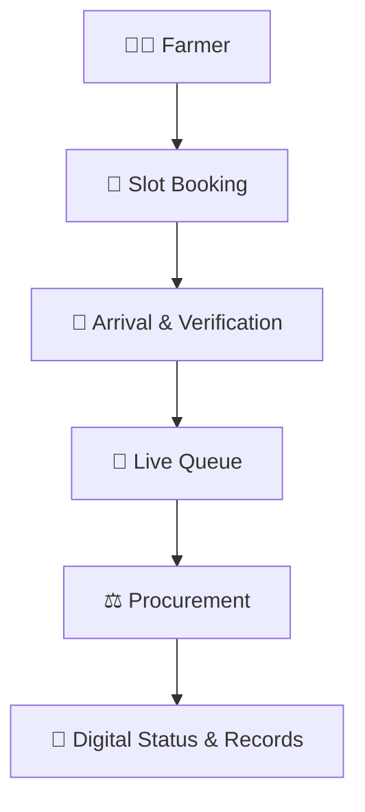

  
  
  
  
   
   

  # 🌾 KisanFlow (किसान प्रवाह)
  
  **A digital procurement coordination platform designed to improve visibility, scheduling, and coordination between farmers and procurement centres.**

 

## 📖 Overview

Every harvest season, farmers face crippling bottlenecks at APMC mandis and state procurement centres. The core issues we are solving include:

- ⏳ **Uncertainty around procurement schedules**, causing farmers to wait in physical lines without knowing when they will be processed.
- ⛽ **Unnecessary waiting**, leading to wasted diesel, lost time, and crop exposure to weather conditions.
- 🌫️ **Lack of queue visibility**, making it difficult to plan the journey from the village to the mandi.
- 📝 **Manual coordination** and fragmentation of status information, which causes confusion at the weighbridge and delays in payments.

**KisanFlow** modernizes this experience by providing a unified, digital coordination layer for both farmers and procurement operators.

 

## 🎯 The Solution

KisanFlow digitizes the inbound logistics of agricultural procurement. It provides an end-to-end coordinated workflow:

> [!NOTE]
> KisanFlow focuses strictly on **procurement coordination and logistics** rather than acting as a commodity trading marketplace (which is handled by e-NAM). Financial transfers (DBT) and external government APIs (PFMS/UIDAI) are *simulated* in this prototype to demonstrate the architecture.

 

## ✨ Key Features

### 🚜 Farmer Application
- 🔒 **Registration & Login**: Secure OTP-based authentication.
- 🧭 **Procurement-centre discovery**: 360° radar to find nearby active mandis.
- 📅 **Slot availability & booking**: Secure a guaranteed unloading window.
- 🎟️ **Booking confirmation**: Receive an offline cryptographic E-Pass (QR code).
- 👁️ **Queue visibility**: Track live progression and estimated wait times.
- 📡 **Procurement status**: Real-time updates on weighbridge and assaying stages.
- 🧾 **Digital Records**: Access to a digital Form 'J' procurement receipt.

### 🏢 Procurement Centre Command
- ⚙️ **Capacity management**: Administrators set daily quotas to prevent yard gridlock.
- 🗓️ **Slot management**: Command center tracks scheduled inbound arrivals.
- 📷 **Arrival verification**: Instant QR code scanning at the gate for rapid ingress.
- 🚦 **Queue management**: Operators advance vehicle statuses (In-Yard, Assaying, Weighbridge).
- ⚖️ **Procurement status updates**: Instant logging of crop moisture and weight.
- 📈 **Operator dashboard**: District-level analytics and throughput monitoring.

### 🔗 Architectural Coordination
- 🤝 **Shared backend state**: Both farmers and operators see the exact same real-time data.
- 🗂️ **Digital booking records**: Elimination of lost paper slips.
- 🔐 **QR booking verification**: Cryptographically signed HMAC-SHA256 tokens for tamper resistance.
- 📍 **Centralized status tracking**: End-to-end visibility for district administrators.

*(Note: Advanced AI/ML forecasting and SMS notifications are planned for future scope; current implementations use deterministic heuristics and simulated APIs).*

 

## 🏗️ Technology Stack

The stack reflects the exact technologies running in the current repository deployment.

| Layer | Technologies |
| --- | --- |
| **Frontend** | React 18, Vite, Tailwind CSS, TypeScript |
| **Backend** | Python 3.10+, FastAPI, SQLAlchemy (Async), Uvicorn |
| **Database** | PostgreSQL 15 (Relational Data & Geospatial matching) |
| **Security** | OAuth2 Password Bearer, JWT (Python-Jose), Bcrypt |
| **DevOps** | Docker, Vercel (Edge CDN), Render (Cloud App & Database) |

 

## 🚀 Live Demo

> [!IMPORTANT]
> The KisanFlow prototype is deployed live. Use the links below to test the platform.

- 👨‍🌾 **[Open Farmer App](https://management-app-fawn-five.vercel.app/)**
- 👮‍♂️ **[Open Management App](https://management-app-mugal1.vercel.app/)**
- ⚙️ **[View Backend API (Swagger UI)](https://kisanflow-backend.onrender.com/docs)**
- 💻 **[View Source Code](https://github.com/mugazhvan/cold-cipher-proc)**

#### 🔑 Public Demo Personas
* **Mandi Operator (Admin)**: `operator1` / `password123`
* **DCA Administrator**: `admin@kisanflow.gov.in` / `password123`

 

## 📚 Documentation Index

Explore the comprehensive research, audits, and plans for the KisanFlow platform:

* 📽️ **[Demo Links & QR Codes](docs/public/DEMO_LINKS.md)** — Quick access for presentations.
* 🔬 **[Research & Provenance](docs/RESEARCH.md)** — Foundational research on APMC bottlenecks and e-NAM integration.
* 📊 **[Reports](docs/REPORTS.md)** — QA, performance profiling, and end-to-end system testing results.
* 📑 **[Audits](docs/AUDITS.md)** — Consolidated security, compliance, source, cost, and accessibility audits.
* 🏗️ **[Implementation Status](docs/IMPLEMENTATION_STATUS.md)** — A strict accounting of what is built vs. simulated.
* ⚠️ **[Limitations](docs/LIMITATIONS.md)** — Responsible disclosure of prototype constraints.
* 🚀 **[Future Plan](docs/FUTURE_PLAN.md)** — Strategic technical expansions and real-world deployment phases.

---

  <i>Built with purpose by Team Cold Cipher for the Smart India Hackathon 2026.</i>

