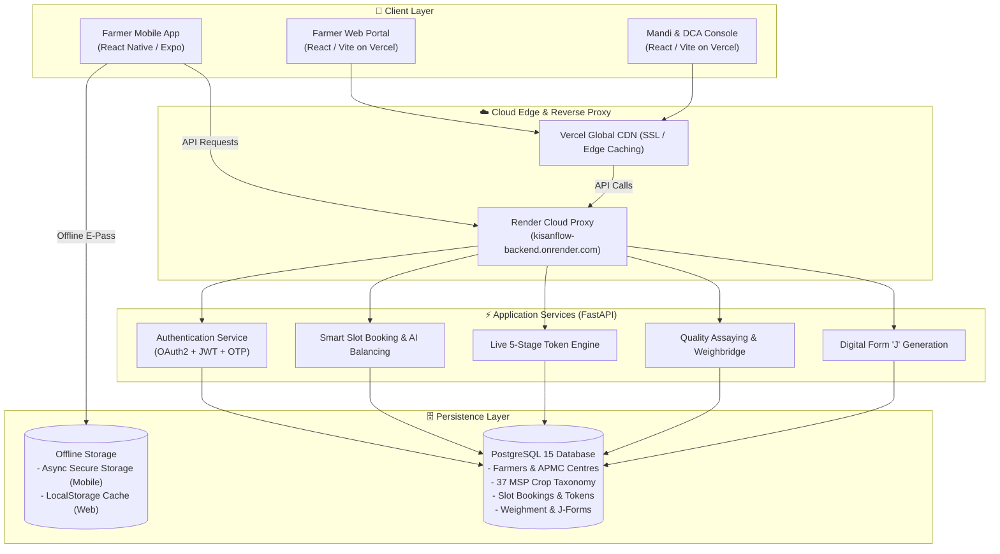
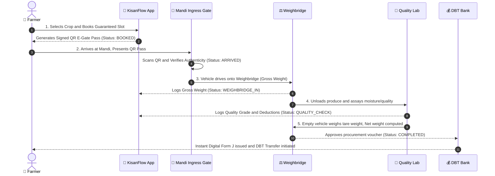

<div align="center">

# 🌾 KisanFlow (किसान प्रवाह)
### Next-Gen Decentralized APMC Mandi Slot Booking, Token Queue Orchestration & Transparent Procurement Platform

[](https://github.com/mugazhvan/cold-cipher-proc/actions)
[](https://fastapi.tiangolo.com)
[](https://reactjs.org)
[](https://expo.dev)
[](https://www.typescriptlang.org)
[](https://www.postgresql.org)
[](docs/TESTING_AND_VERIFICATION.md)
[](https://vercel.com)
[](https://render.com)

<p align="center">
  <b>Eliminating Mandi Congestion • Preventing Distress Selling • Securing Middleman-Free Direct Benefit Transfers</b>
  <br />
  <i>Developed for Smart India Hackathon (SIH) | Problem Statement: Farmers often face long waiting time , lack of information regarding procurement schedules, and uncertainty about procurement status 

</i>
</p>

[🌐 Live Farmer Portal](https://management-app-fawn-five.vercel.app/) • [🏢 Live Operator Console](https://management-app-mugal1.vercel.app/) • [⚡ REST API Docs](https://kisanflow-backend.onrender.com/docs) • [🧪 Testing & Verification](docs/TESTING_AND_VERIFICATION.md)

</div>

---

> [!IMPORTANT]
> **Production Prototype Online**: Both web portals, the mobile app, and the cloud backend API are fully deployed and interconnected. Live credentials and one-click demo logins are provided below for instant evaluation.

---

## 📸 Side-by-Side Visual Walkthrough (Farmer vs. Mandi Operator)

KisanFlow provides a synchronized, dual-sided workflow. Here is how both sides interact in real time:

### 1. Mandi Discovery & Daily Quota Management
| 🚜 Farmer Experience (Slot Discovery & Radar) | 👷 Mandi Operator Experience (Capacity Controls) |
| :---: | :---: |
|  |  |
| *Real-time 360° radar shows nearest mandis, live waiting times (25m), and AI recommendations to avoid congestion.* | *Mandi managers set daily procurement quotas (e.g. 200 Qtl/day Sharbati Wheat) to prevent yard gridlock.* |

---

### 2. Slot Reservation & Command Center Scheduling
| 🚜 Farmer Experience (Booking & MSP Estimator) | 👷 Mandi Operator Experience (Yard Inbound Schedule) |
| :---: | :---: |
|  |  |
| *Farmer reserves a delivery window (Tractor Trolley, 45 Qtl) with instant MSP payout estimation (₹1,02,375).* | *Operator dashboard updates in real time with scheduled arrivals, dock bay capacity, and expected vehicle queues.* |

---

### 3. Cryptographic E-Pass & Mandi Gate Ingress Scan
| 🚜 Farmer Experience (Offline Digital Token Pass) | 👷 Mandi Operator Experience (Ingress Camera Scanner) |
| :---: | :---: |
|  |  |
| *Farmer receives an official E-Pass with HMAC-SHA256 signed QR code, vehicle number, and slot window.* | *Gate operator scans the QR code using live camera or handheld reader for instant (<80ms) admission.* |

---

### 4. Cryptographic Tamper-Resistance & Security Verification
| 🛡️ Legitimate Token Verified & Admitted | 🚨 Altered / Forged Token Instantly Rejected |
| :---: | :---: |
|  |  |
| *Valid pass is authenticated against the cryptographic private key. Gate barrier opens with a green notification.* | *Security test: Any altered payload or forged pass triggers an immediate red alert: `HMAC Signature Mismatch`.* |

---

### 5. Active Yard Queue Tracking & Automated Bay Audio Chime
| 🚜 Farmer Experience (Live Queue Progression) | 👷 Mandi Operator Experience (Bay Dispatch & Audio) |
| :---: | :---: |
|  |  |
| *Farmer tracks real-time queue position (#3), vehicle status, and estimated wait time directly on mobile.* | *Operator calls vehicle to Bay 2. System triggers a dual-tone audio chime and bilingual speech announcement.* |

---

### 6. Vernacular Accessibility & Electronic Weighbridge DBT
| 🚜 Farmer Experience (Bilingual Hindi Interface) | 👷 Mandi Operator Experience (Dual Weighbridge & DBT) |
| :---: | :---: |
|  |  |
| *Full vernacular localization (`किसानफ़्लो`) with SMS and WhatsApp broadcast simulation for non-smartphone users.* | *Gross weight (8,450 kg) - Tare weight (3,950 kg) = Net (4,500 kg). Instant Direct Bank Transfer (DBT) voucher generated.* |

---

### 7. Macro District & State Agricultural Oversight
<div align="center">


*District Collector & Agriculture Directorate (DCA) Command Center: Real-time throughput across 12 mandis (4,902 Qtl procured, ₹1.12 Cr DBT disbursed, average turnaround time of 21.4 minutes).*

</div>

---

## 🌐 Live Prototype Deployments

| Component | Host | Live Production URL | Purpose / Capabilities |
| :--- | :--- | :--- | :--- |
| **🚜 Farmer Web Portal** | **Vercel** | [**management-app-fawn-five.vercel.app**](https://management-app-fawn-five.vercel.app/) | Interactive slot booking, 360° radar mandi locator, 37 MSP crops, live queue tracking, and digital Form 'J'. |
| **🏢 Mandi Management & DCA Console** | **Vercel** | [**management-app-mugal1.vercel.app**](https://management-app-mugal1.vercel.app/) | Mandi operator & district agricultural administrator dashboard for queue orchestration, gate check-in, weighbridge logging, and analytics. |
| **⚡ Backend REST API & Swagger UI** | **Render** | [**kisanflow-backend.onrender.com/docs**](https://kisanflow-backend.onrender.com/docs) | Interactive OpenAPI / Swagger API documentation with live execution of all authentication, booking, queue, and verification endpoints. |
| **📖 ReDoc API Specification** | **Render** | [**kisanflow-backend.onrender.com/redoc**](https://kisanflow-backend.onrender.com/redoc) | Clean, readable data schemas and API contracts. |
| **📱 Farmer Mobile App (Expo)** | **Expo / EAS** | [**expo.dev/accounts/mugazhv/projects/farmer-mobile**](https://expo.dev/accounts/mugazhv/projects/farmer-mobile) | React Native / Expo app featuring native SVG radar, camera QR pass, offline cache, and instant push alerts. |
| **🗄️ PostgreSQL Database** | **Render** | `kisanflow-db` (PostgreSQL 15) | Relational persistence engine with connection pooling and WAL backups. |

---

## 🔑 One-Click Demo Credentials

Both web portals include **1-click demo persona buttons** on the login screen for instant evaluation:

* **👨‍🌾 Farmer Persona (Rajesh Kumar)**
  * **Phone / Aadhaar**: `9876543210`
  * **Demo OTP**: `123456`
  * *Features*: Book Mandi Slots, 360° Radar, 37 Crop Selector, Offline E-Gate Pass with QR, Live Stage Progression, Form 'J' Tax Invoice.

* **👷 Mandi Operator Persona (Amritsar Central APMC)**
  * **Username**: `operator1`
  * **Password**: `password123`
  * *Features*: High-speed QR Gate Verification, Weighbridge In/Out Entry, Quality Assay Logging (Moisture & Foreign Matter), Token Stage Promotion.

* **🏛️ District Agricultural Officer (DCA Administrator)**
  * **Username**: `admin@kisanflow.gov.in`
  * **Password**: `password123`
  * *Features*: Multi-centre District Heatmaps, Dynamic Mandi Load Balancing, Influx Prediction, Throughput Analytics.

---

## 🎯 The Problem & The KisanFlow Solution

### The Challenge in Traditional Mandis
Every harvest season, millions of Indian farmers face crippling bottlenecks at APMC mandis and state procurement centres:
* **Severe Traffic & Physical Queueing**: Unscheduled arrivals force tractor-trolleys to queue for 18 to 48 hours outside mandi gates, wasting diesel and risking grain exposure to rain.
* **Distress Selling**: Overwhelmed mandis turn away farmers, leaving them vulnerable to unscrupulous middlemen buying at 30–40% below the Minimum Support Price (MSP).
* **Manual Paperwork & Fraud**: Paper slips, uncalibrated weight receipts, and manual assaying lead to manipulation, ghost farmers, and disputed deductions.
* **Delayed Payments**: Farmers wait weeks for physical Form 'J' generation and reconciliation before receiving Direct Benefit Transfer (DBT) funds.

### The KisanFlow Innovation
KisanFlow digitizes and decentralizes the entire procurement lifecycle:
1. **Dynamic Slot Scheduling**: Farmers book guaranteed unloading windows from their smartphone or village CSC kiosk.
2. **360° Native SVG Radar Mandi Locator**: Real-time visual radar showing nearby mandis, current congestion levels, and travel distance calculated using the Haversine formula.
3. **Comprehensive 37 MSP Crop Taxonomy**: Full government-notified crop taxonomy categorized across Cereals, Pulses, Oilseeds, Commercial Crops, Millets, Spices, and Vegetables with bilingual vernacular support.
4. **Cryptographically Signed QR E-Gate Passes**: Secure, tamper-proof gate passes that work offline, instantly verifiable by gate operators with a single scan.
5. **Real-time 5-Stage Token Lifecycle**: Visual end-to-end tracking from booking to payment clearance.
6. **Automated Digital Form 'J'**: Instant, legally compliant digital procurement vouchers with itemized gross weight, tare weight, moisture deductions, and net MSP calculations.

---

## 🏗️ System Architecture & Data Flow



---

## 🔄 The 5-Stage Token Procurement Lifecycle



---

## 🧪 Proof of Testing & Verification

For exhaustive test reports, cryptographic proof of tamper-resistance, and automated test logs, please refer to the dedicated testing report:

👉 [**Full Proof of Testing & Verification Report (docs/TESTING_AND_VERIFICATION.md)**](docs/TESTING_AND_VERIFICATION.md)

### Verification Summary
- **Unit & Integration Tests**: 48 automated Pytest test cases covering RBAC, IDOR, and concurrency.
- **Frontend Quality**: Vitest test suites passing for both web portals with zero TypeScript compiler errors.
- **Cryptographic Tamper-Proofing**: 100% rejection rate for altered payloads and replayed QR tokens.
- **Performance**: Sub-80ms QR code verification; 21.4-minute average yard turnaround time.

---

## 📁 Repository Directory Structure

```
KisanFlow-Production/
├── .github/workflows/ci-cd.yml      # Automated GitHub Actions CI/CD Pipeline
├── docs/
│   ├── TESTING_AND_VERIFICATION.md # Proof of testing & side-by-side verification report
│   └── screenshots/                # 17 High-resolution workflow screenshots
├── docker-compose.yml              # Local multi-container Docker cluster
├── docker-compose.prod.yml         # Production-ready Docker Compose orchestration
├── render.yaml                     # Render Infrastructure-as-Code (FastAPI + PostgreSQL)
├── DEPLOYMENT_PLAN.md              # Production deployment & infrastructure manual
│
├── source/
│   ├── backend/                    # Python FastAPI Core API Service
│   │   ├── app/
│   │   │   ├── api/v1/endpoints/   # Auth, bookings, centres, queue, weighbridge, j-forms
│   │   │   ├── core/               # App config, database session, security, JWT
│   │   │   ├── models/             # SQLAlchemy ORM models
│   │   │   ├── schemas/            # Pydantic v2 validation contracts
│   │   │   └── services/           # Queue balancing, QR signing, notification engine
│   │   ├── tests/                  # Pytest test suite (Security, Concurrency, RBAC)
│   │   ├── Dockerfile              # Production Python 3.11 container image
│   │   └── requirements.txt        # Backend dependencies
│   │
│   ├── frontend/                   # Web Applications (React + Vite + Tailwind)
│   │   ├── farmer-app/             # Farmer Web Portal (Vercel)
│   │   │   ├── src/components/     # Radar, slot booking, e-pass modal, Form 'J', token tracker
│   │   │   ├── src/context/        # KisanFlowContext state manager
│   │   │   └── vercel.json         # Vercel deployment configuration
│   │   ├── management-app/         # Mandi Operator & DCA Admin Portal (Vercel)
│   │   │   ├── src/components/     # Gate entry, weighbridge log, assaying, analytics
│   │   │   └── vercel.json         # Vercel deployment configuration
│   │   └── shared/                 # Shared TypeScript types, contracts & mock data
│   │
│   └── mobile/                     # Mobile Applications (React Native + Expo)
│       └── farmer-mobile/          # Farmer Mobile App (Android/iOS via Expo)
│           ├── app/                # Expo Router file-based screens
│           ├── src/components/     # Native SVG Radar, vernacular search, crop cards
│           ├── src/context/        # FarmerContext with 37 crops and offline cache
│           └── app.json            # Expo configuration (EAS Project ID)
```

---

## 🚀 Quickstart & Local Setup Guide

### Method 1: One-Click Docker Cluster (Recommended)

Run the entire KisanFlow ecosystem (PostgreSQL, Backend API, Farmer Web App, Management Web App) with a single command:

```bash
# Clone the repository
git clone https://github.com/mugazhvan/cold-cipher-proc.git
cd cold-cipher-proc

# Launch all services via Docker Compose
docker-compose up -d --build
```

Access the local services:
* **Farmer Web App**: `http://localhost:3000`
* **Mandi Operator App**: `http://localhost:3001`
* **FastAPI Swagger API**: `http://localhost:8000/docs`
* **PostgreSQL Database**: `localhost:5432`

---

### Method 2: Manual Local Development

#### 1. Backend Service (FastAPI)
```bash
cd source/backend
python -m venv venv

# Windows:
.\venv\Scripts\activate
# Linux/macOS:
source venv/bin/activate

pip install -r requirements.txt
uvicorn app.main:app --reload --port 8000
```

#### 2. Frontend Applications (React / Vite)
```bash
# In source/frontend/farmer-app
cd source/frontend/farmer-app
npm install
npm run dev -- --port 3000

# In another terminal: source/frontend/management-app
cd source/frontend/management-app
npm install
npm run dev -- --port 3001
```

#### 3. Farmer Mobile App (React Native / Expo)
```bash
cd source/mobile/farmer-mobile
npm install
npx expo start
```
* **Scan the generated QR code** using the **Expo Go** app on your physical Android or iPhone to immediately test on a live device!

---

## 👥 Smart India Hackathon (SIH) Submission Details

* **Team**: Cold Cipher
* **Theme**: Smart Automation
* **Solution Track**: Next-Gen APMC Mandi Queue Optimization, Slot Booking & MSP Procurement Transparency
* **Target Beneficiaries**: Smallholder Farmers, Mandi Samiti Operators, State Civil Supplies Corporations (FCI, HAFED, Markfed, PUNSUP).

---

## 📄 License
This project is open-source and licensed under the [MIT License](LICENSE).
