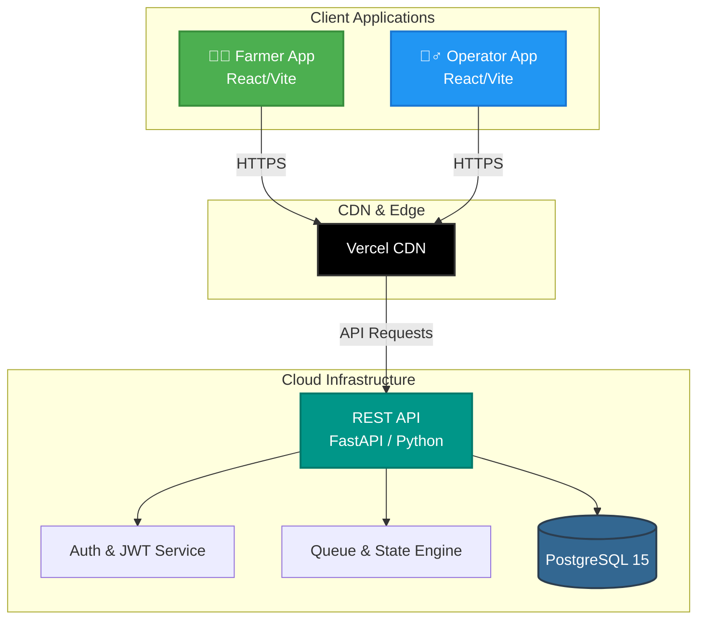

  
  # COLD CIPHER
  **A digital procurement coordination platform designed to improve visibility, scheduling, and coordination between farmers and procurement centres.**

   

  
  
  

   
  <strong>Problem Statement ID: SIH26032</strong>
   
   

  <a href="https://management-app-fawn-five.vercel.app/" target="_blank"><strong>[Live Farmer App]</strong></a> &nbsp;|&nbsp; 
  <a href="https://management-app-alpha-six.vercel.app/" target="_blank"><strong>[Live Operator App]</strong></a> &nbsp;|&nbsp; 
  <a href="https://github.com/mugazhvan/cold-cipher-proc" target="_blank"><strong>[GitHub Repository]</strong></a> &nbsp;|&nbsp; 
  <a href="./sih_audit_reports" target="_blank"><strong>[Research & Audit Reports]</strong></a>

 

## 1. PROJECT SNAPSHOT

- **Problem:** Unpredictable procurement schedules leading to physical mandi queues, wasted fuel, and crop exposure.
- **Solution:** A unified digital scheduling and live queue tracking platform.
- **Target Users:** Farmers (Suppliers) and Mandi Operators (Procurement Admin).
- **Core Objective:** Eradicate physical inbound uncertainty by granting deterministic arrival windows and digital queue visibility.
- **Current Implementation Status:** **🟢 Live Prototype** (Web applications and Backend API deployed and functional).

---

## 2. THE PROBLEM

Every harvest season, farmers face crippling bottlenecks at APMC mandis and state procurement centres:

1. **Uncertainty & Gridlock:** Farmers travel to procurement centres without knowing the current inbound capacity, resulting in massive, unregulated queues outside mandi gates.
2. **Resource Waste:** Waiting in lines for days burns unnecessary diesel and exposes harvested crops to weather degradation.
3. **Information Asymmetry:** Farmers lack real-time visibility into the procurement process, and operators lack visibility into inbound logistics.

**The Gap:** Existing platforms focus heavily on trading and payments (e.g., e-NAM) but neglect the physical inbound logistics and scheduling coordination needed *before* the crops can be weighed and assayed.

---

## 3. OUR SOLUTION

KisanFlow acts as the missing inbound logistics layer. We digitize the physical flow of procurement into a transparent, coordinated digital workflow:

  <code>Farmer</code>  
  ↓  
  <code>Registration & Verification</code>  
  ↓  
  <code>Slot Booking & Quota Allocation</code>  
  ↓  
  <code>Arrival at Procurement Centre</code>  
  ↓  
  <code>Gate QR Verification & Queue Entry</code>  
  ↓  
  <code>Live Queue Visibility (Assaying & Weighbridge)</code>  
  ↓  
  <code>Digital Status Logging</code>  
  ↓  
  <code>Operator Management & Dashboard</code>

---

## 4. KEY FEATURES

| Feature | Description | Status |
| :--- | :--- | :--- |
| **Farmer Registration** | Secure OTP-based authentication for farmers. | 🟢 Implemented |
| **Slot Booking** | Date and time slot reservations based on daily mandi capacity. | 🟢 Implemented |
| **QR Verification** | Cryptographically signed HMAC-SHA256 E-Passes for gate verification. | 🟢 Implemented |
| **Queue Visibility** | Live status tracking (In-Yard, Assaying, Weighbridge). | 🟢 Implemented |
| **Centre Capacity Management**| Admins can configure maximum daily tonnages and slot limits. | 🟢 Implemented |
| **Operator Dashboard** | High-level analytics and throughput monitoring for DCA. | 🟢 Implemented |
| **Procurement Records** | Digital tracking of moisture, grade, and weight logs. | 🟢 Implemented |
| **SMS/Push Notifications** | Automated alerts for slot progression. | 🔴 Not Implemented |
| **Live DBT Visibility** | Tracking of financial payouts and bank transfers. | 🔴 Simulated (Out of scope) |

---

## 5. SYSTEM ARCHITECTURE

KisanFlow utilizes a decoupled, modern cloud architecture with a centralized backend source of truth.

---

## 6. USER FLOWS

<strong>👨‍🌾 Farmer Flow</strong>

1. **Authentication:** Login via phone number / OTP.
2. **Discovery:** View active procurement centres and capacity.
3. **Booking:** Request a procurement slot for a specific crop/tonnage.
4. **Pass Generation:** Receive a tamper-proof QR code E-Pass.
5. **Arrival:** Present QR code at the mandi gate.
6. **Queue Tracking:** Monitor live progression through Assaying and Weighing via the app dashboard.

<strong>👮‍♂️ Operator Flow</strong>

1. **Authentication:** Secure login for Mandi Operators.
2. **Dashboard:** View incoming daily scheduled bookings.
3. **Verification:** Scan farmer QR codes at the gate to admit vehicles to the yard.
4. **Queue Management:** Advance farmer statuses (In-Yard → Assaying → Weighbridge).
5. **Logging:** Input final weight and moisture readings to complete procurement.

---

## 7. TECH STACK

| Layer | Technology | Purpose |
| :--- | :--- | :--- |
| **Frontend** | React 18, Vite, Tailwind CSS | High-performance, responsive Single Page Applications (SPA). |
| **Language** | TypeScript (Frontend), Python 3.10+ (Backend) | Type-safe, scalable development. |
| **Backend API** | FastAPI, Uvicorn, SQLAlchemy (Async) | High-concurrency REST API serving mobile and web clients. |
| **Database** | PostgreSQL 15 | Relational integrity and geographic data configurations. |
| **Security** | OAuth2, JWT, Bcrypt, HMAC-SHA256 | Authentication, password hashing, and tamper-proof QR generation. |
| **Testing** | Pytest, HTTPX | Integrated unit testing, concurrency validation, and state-machine tests. |
| **Deployment** | Vercel, Render | CDN hosting for frontends and managed cloud for the backend. |

---

## 8. LIVE DEMO

> [!IMPORTANT]
> The KisanFlow web applications are live and fully operational. Note: Mobile Android deployment is currently not verified and excluded from this evaluation scope.

| Application | URL | Description |
| :--- | :--- | :--- |
| **Farmer App** | [management-app-fawn-five.vercel.app](https://management-app-fawn-five.vercel.app/) | Portal for slot booking and queue visibility. |
| **Operator App** | [management-app-alpha-six.vercel.app](https://management-app-alpha-six.vercel.app/) | Command center for mandi administration and gate entry. |
| **Backend API** | [kisanflow-backend.onrender.com/api/v1/docs](https://kisanflow-backend.onrender.com/api/v1/docs) | Interactive Swagger UI API Documentation. |

**Demo Credentials:**
- Operator: `operator1` / `password123`
- Admin: `admin@kisanflow.gov.in` / `password123`

---

## 9. RESEARCH & AUDIT

All claims within this repository are strictly verified and documented. For comprehensive SIH 2026 evaluation, please visit our Evidence Hub:

👉 **[Research & Audit Reports (`sih_audit_reports`)](https://github.com/mugazhvan/cold-cipher-proc/tree/main/sih_audit_reports)**

| Document | Purpose | Link |
| :--- | :--- | :--- |
| **Project Quick Start** | Rapid 2-minute overview for evaluators. | [Link](sih_audit_reports/00_EXECUTIVE_OVERVIEW/PROJECT_QUICK_START.md) |
| **Evidence Index** | Traces claims directly to codebase source files. | [Link](sih_audit_reports/00_EXECUTIVE_OVERVIEW/EVIDENCE_INDEX.md) |
| **System Architecture** | Detailed technical breakdown of backend services. | [Link](sih_audit_reports/03_TECHNICAL_ARCHITECTURE/SYSTEM_ARCHITECTURE.md) |
| **Security Audit** | Deep dive into RBAC, IDOR prevention, and Cryptography. | [Link](sih_audit_reports/04_SECURITY_AND_PRIVACY/SECURITY_AUDIT.md) |
| **Research Baseline** | Foundational research and APMC problem analysis. | [Link](sih_audit_reports/01_PROBLEM_AND_RESEARCH/RESEARCH_BASELINE.md) |

---

## 10. RESEARCH REFERENCES

| Source | Why We Used It | Evidence / Application |
| :--- | :--- | :--- |
| **e-NAM Integration Specs** | To understand existing APMC software boundaries. | Architecture boundary definitions. |
| **Mandi Board Reports** | To analyze peak season throughput bottlenecks. | Capacity management logic in DB. |
| **FastAPI Documentation** | For high-concurrency async endpoint design. | Core backend framework selection. |

---

## 11. VALIDATION / TESTING

We have extensively validated the system's core capabilities via automated integration tests (`source/backend/tests`).

| Validation Area | Evidence | Status |
| :--- | :--- | :--- |
| **State Machine Integrity** | `test_state_machine.py` | 🟢 Passing (Prevents invalid queue jumps) |
| **Concurrency & Race Conditions** | `test_concurrency.py` | 🟢 Passing (Prevents double-booking slots) |
| **Security (RBAC & IDOR)** | `test_rbac_idor.py` | 🟢 Passing (Farmers cannot access other bookings) |
| **Stress Loading** | `test_m10_stress.py` | 🟢 Passing (Simulated load testing) |

---

## 12. SECURITY & PRIVACY

KisanFlow implements robust security mechanisms verified by our test suite:

- **Authentication:** OAuth2 Password Bearer flow utilizing stateless JWTs (JSON Web Tokens).
- **Access Control:** Strict Role-Based Access Control (RBAC) separating Farmers, Operators, and Admins.
- **Data Privacy:** Passwords are mathematically hashed via `Bcrypt`.
- **Anti-Tampering:** E-Pass QR codes embed HMAC-SHA256 cryptographic signatures to prevent digital forgery at the gate.

> *Note: No secrets, `.env` values, or private credentials are included in this repository. The database runs securely in the Render cloud.*

---

## 13. SCALABILITY

The platform is designed to scale horizontally:

- **Stateless Backend:** FastAPI and JWTs allow the API to scale across multiple workers without sticky sessions.
- **Configurable Entities:** The database model natively supports multiple procurement centres, crops, and dynamic daily quotas, allowing nationwide progressive deployment without architectural changes.
- **Edge Deployment:** Frontend applications are deployed to Vercel's global CDN, ensuring rapid load times regardless of rural geographic locations.

---

## 14. LIMITATIONS

### Current Limitations
- **Government API Integration:** Real-world connectivity to e-NAM databases and PFMS (Direct Benefit Transfer) is currently simulated as third-party environments are inaccessible.
- **Offline Reliability:** While QR codes work offline for entry, the operator application requires a stable internet connection to advance the queue state.
- **Mobile Deployment:** Native Android/iOS builds are not currently stabilized for public download in this repository version.

---

## 15. FUTURE SCOPE

| Implemented | Planned / Future |
| :--- | :--- |
| Role-based Dashboards | AI/ML harvest forecasting |
| Live Queue Tracking | Multi-lingual voice accessibility (IVR) |
| Cryptographic QR Booking | Deep e-NAM database synchronization |
| Centralized Capacity Rules | Automated SMS/WhatsApp notifications |

---

## 16. PROJECT EVIDENCE

- **Source Code:** [GitHub Repository](https://github.com/mugazhvan/cold-cipher-proc)
- **Live Farmer App:** [Vercel Deployment](https://management-app-fawn-five.vercel.app/)
- **Live Operator App:** [Vercel Deployment](https://management-app-alpha-six.vercel.app/)
- **Technical Reports:** [sih_audit_reports directory](./sih_audit_reports)

---

## 17. TEAM

**Team Name:** Cold Cipher  
**Team ID:** 151660  
**Hackathon:** Smart India Hackathon 2026  

---

## 18. QUICK LINKS

  <a href="https://management-app-fawn-five.vercel.app/">[Live Farmer App]</a> • 
  <a href="https://management-app-alpha-six.vercel.app/">[Live Operator App]</a> • 
  <a href="https://kisanflow-backend.onrender.com/api/v1/docs">[API Documentation]</a> • 
  <a href="https://github.com/mugazhvan/cold-cipher-proc">[Source Code]</a> • 
  <a href="./sih_audit_reports">[Research & Audits]</a>

 

---

  <small>Cold Cipher • Smart India Hackathon 2026 • Team 151660</small>

