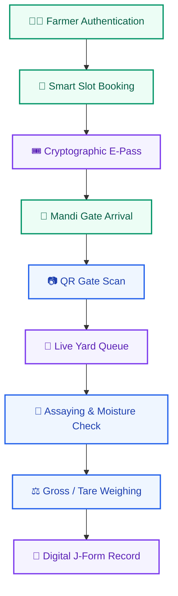
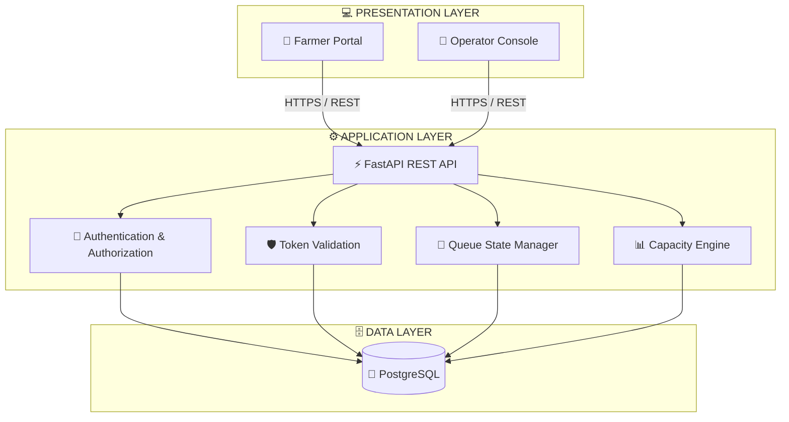
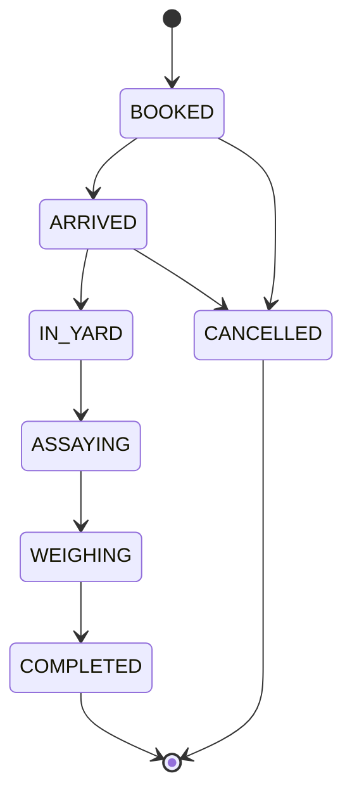

<div align="center">

# 🌾 COLD CIPHER — KISANFLOW

### Digital Procurement Coordination & Inbound Yard Logistics Platform

<p>
  <em>
    Turning unpredictable agricultural arrivals into coordinated,
    capacity-aware procurement workflows.
  </em>
</p>

<br/>

<a href="https://github.com/mugazhvan/cold-cipher-proc">
  
</a>
<a href="https://github.com/mugazhvan/cold-cipher-proc">
  
</a>
<a href="https://github.com/mugazhvan/cold-cipher-proc">
  
</a>
<a href="https://github.com/mugazhvan/cold-cipher-proc">
  
</a>

<br/>
<br/>

<a href="https://management-app-fawn-five.vercel.app/">
  
</a>
&nbsp;
<a href="https://management-app-alpha-six.vercel.app/">
  
</a>
&nbsp;
<a href="https://kisanflow-backend.onrender.com/api/v1/docs">
  
</a>

<br/>
<br/>

<a href="./sih_audit_reports">
  
</a>

</div>

<br/>

---

# 📌 Project Snapshot

<table>
<tr>
<td width="25%"><strong>🎯 Problem</strong></td>
<td>
Agricultural procurement centers can experience unpredictable vehicle arrivals,
creating congestion, waiting time, fuel consumption, and operational bottlenecks.
</td>
</tr>

<tr>
<td><strong>💡 Solution</strong></td>
<td>
KisanFlow coordinates farmer arrivals through digital scheduling,
capacity-aware slot booking, QR-based entry validation, live yard progression,
and digital procurement records.
</td>
</tr>

<tr>
<td><strong>👥 Users</strong></td>
<td>
<strong>Farmers</strong> • <strong>Mandi Operators</strong> •
<strong>Administrative / District Users</strong>
</td>
</tr>

<tr>
<td><strong>🚀 Objective</strong></td>
<td>
Replace uncertain physical arrival coordination with a transparent,
capacity-aware digital workflow.
</td>
</tr>

<tr>
<td><strong>🟢 Prototype</strong></td>
<td>
Cloud-deployed web applications with a REST API and PostgreSQL-backed
procurement workflow.
</td>
</tr>
</table>

---

# 🔍 1. The Problem

Agricultural procurement is not only a trading problem.

Before a commodity can be weighed, graded, recorded, and purchased,
the farmer and vehicle must physically reach the procurement center and
move through several operational stages.

A poorly coordinated arrival pattern can create:

```text
🚜 Unplanned Arrivals
        ↓
🚧 Gate Congestion
        ↓
🚦 Yard Queue
        ↓
⏳ Waiting Time
        ↓
⚖️ Weighbridge / Assaying Bottleneck
        ↓
📄 Administrative Delay
```

### Key operational gaps

| Gap | Consequence |
|---|---|
| 📅 No coordinated arrival schedule | Unpredictable vehicle load |
| 🚦 Limited queue visibility | Farmers cannot easily estimate waiting time |
| 🏭 Fixed operational capacity | Sudden arrival spikes overload the yard |
| 📷 Manual gate verification | Slower ingress and greater administrative effort |
| ⚖️ Disconnected procurement stages | Difficult end-to-end tracking |
| 📄 Fragmented records | Greater scope for data-entry delays |

> **KisanFlow focuses on the physical inbound procurement workflow — from planned arrival to yard processing and digital record generation.**

---

# ⚡ 2. Solution Overview

KisanFlow introduces a coordinated workflow connecting the farmer,
procurement center, gate, yard, assaying process, weighbridge, and
digital procurement record.


```mermaid
flowchart TD

    A["👨‍🌾 Farmer Authentication"]
    B["📅 Smart Slot Booking"]
    C["🎟️ Cryptographic E-Pass"]
    D["🚜 Mandi Gate Arrival"]
    E["📷 QR Gate Scan"]
    F["🚦 Live Yard Queue"]
    G["🔬 Assaying & Moisture Check"]
    H["⚖️ Gross / Tare Weighing"]
    I["📄 Digital J-Form Record"]

    A --> B
    B --> C
    C --> D
    D --> E
    E --> F
    F --> G
    G --> H
    H --> I

    classDef farmer fill:#ECFDF5,stroke:#059669,stroke-width:2px,color:#065F46
    classDef mandi fill:#EFF6FF,stroke:#2563EB,stroke-width:2px,color:#1E40AF
    classDef system fill:#F5F3FF,stroke:#7C3AED,stroke-width:2px,color:#5B21B6

    class A,B,D farmer
    class E,G,H mandi
    class C,F,I system
```

### Workflow

**1. Authenticate → 2. Reserve → 3. Receive E-Pass → 4. Arrive → 5. Scan → 6. Queue → 7. Assay → 8. Weigh → 9. Record**

The system is designed around a single operational principle:

> **Plan the arrival before the vehicle reaches the gate, then maintain visibility throughout the procurement journey.**

---

# ✨ 3. Core Platform Capabilities

<table>
<thead>
<tr>
<th>Capability</th>
<th>Purpose</th>
<th>Status</th>
</tr>
</thead>

<tbody>

<tr>
<td><strong>🔐 Farmer Authentication</strong></td>
<td>Low-friction farmer login and session management.</td>
<td>🟢 Implemented</td>
</tr>

<tr>
<td><strong>📅 Dynamic Slot Booking</strong></td>
<td>Reserve arrival windows based on configured mandi capacity.</td>
<td>🟢 Implemented</td>
</tr>

<tr>
<td><strong>🎟️ QR E-Pass</strong></td>
<td>Generate signed booking credentials for gate validation.</td>
<td>🟢 Implemented</td>
</tr>

<tr>
<td><strong>🚦 Live Queue Tracking</strong></td>
<td>Track vehicle progression through operational states.</td>
<td>🟢 Implemented</td>
</tr>

<tr>
<td><strong>⚙️ Capacity Engine</strong></td>
<td>Configure daily throughput and operational limits.</td>
<td>🟢 Implemented</td>
</tr>

<tr>
<td><strong>📊 Administrative Console</strong></td>
<td>Monitor procurement activity and operational state.</td>
<td>🟢 Implemented</td>
</tr>

<tr>
<td><strong>📑 Digital Procurement Records</strong></td>
<td>Store moisture, quality, weight, and procurement information.</td>
<td>🟢 Implemented</td>
</tr>

<tr>
<td><strong>📲 SMS / IVR Notifications</strong></td>
<td>Provide arrival reminders and queue notifications.</td>
<td>🟡 Planned</td>
</tr>

<tr>
<td><strong>💳 DBT / PFMS Integration</strong></td>
<td>Represent the future settlement workflow.</td>
<td>🟡 Simulated</td>
</tr>

</tbody>
</table>

---

# 🏛️ 4. System Architecture


```mermaid
flowchart TB

    subgraph CLIENT["💻 PRESENTATION LAYER"]
        FARMER["🌾 Farmer Portal"]
        OPERATOR["👮 Operator Console"]
    end

    subgraph API["⚙️ APPLICATION LAYER"]
        FASTAPI["⚡ FastAPI REST API"]
        AUTH["🔐 Authentication & Authorization"]
        SECURITY["🛡️ Token Validation"]
        QUEUE["🚦 Queue State Manager"]
        CAPACITY["📊 Capacity Engine"]
    end

    subgraph DATA["🗄️ DATA LAYER"]
        DB[("🐘 PostgreSQL")]
    end

    FARMER -->|HTTPS / REST| FASTAPI
    OPERATOR -->|HTTPS / REST| FASTAPI

    FASTAPI --> AUTH
    FASTAPI --> SECURITY
    FASTAPI --> QUEUE
    FASTAPI --> CAPACITY

    AUTH --> DB
    SECURITY --> DB
    QUEUE --> DB
    CAPACITY --> DB
```

### Deployment topology

```text
                    ┌──────────────────────┐
                    │      FARMER          │
                    │      PORTAL          │
                    └──────────┬───────────┘
                               │
                               │ HTTPS
                               ▼
                    ┌──────────────────────┐
                    │       VERCEL         │
                    │   Frontend Hosting   │
                    └──────────┬───────────┘
                               │
                               │ REST API
                               ▼
                    ┌──────────────────────┐
                    │       RENDER         │
                    │      FastAPI         │
                    └──────────┬───────────┘
                               │
                               ▼
                    ┌──────────────────────┐
                    │     POSTGRESQL       │
                    │    Persistent Data   │
                    └──────────────────────┘
```

---

# 🔄 5. Detailed User Workflows

<details open>
<summary><strong>👨‍🌾 Farmer Journey</strong></summary>

<br/>

```text
LOGIN
  ↓
SELECT MANDI
  ↓
SELECT CROP
  ↓
CHECK CAPACITY
  ↓
BOOK SLOT
  ↓
RECEIVE QR E-PASS
  ↓
ARRIVE AT MANDI
  ↓
SCAN AT GATE
  ↓
TRACK YARD QUEUE
  ↓
COMPLETE PROCUREMENT
```

### Farmer workflow

1. Authenticate using the farmer portal.
2. Select the procurement center and crop.
3. View available capacity.
4. Reserve an arrival slot.
5. Receive the QR-based E-Pass.
6. Present the pass at the mandi gate.
7. Track queue progression.
8. Complete assaying and weighing.
9. Receive the resulting digital procurement record.

</details>

<br/>

<details open>
<summary><strong>👮 Mandi Operator Journey</strong></summary>

<br/>

```text
OPERATOR LOGIN
  ↓
GATE SCAN
  ↓
VALIDATE E-PASS
  ↓
ADMIT VEHICLE
  ↓
UPDATE QUEUE
  ↓
ASSAY / MOISTURE
  ↓
GROSS WEIGHT
  ↓
TARE WEIGHT
  ↓
FINALIZE RECORD
```

### Operator workflow

1. Authenticate into the operator console.
2. Scan the incoming QR E-Pass.
3. Validate booking and arrival status.
4. Admit the vehicle.
5. Move the vehicle through queue states.
6. Record quality and moisture information.
7. Record gross and tare weights.
8. Finalize the procurement record.

</details>

---

# 🧠 6. State Machine

KisanFlow models the physical procurement process as controlled state transitions.


```mermaid
stateDiagram-v2

    [*] --> BOOKED

    BOOKED --> ARRIVED
    ARRIVED --> IN_YARD
    IN_YARD --> ASSAYING
    ASSAYING --> WEIGHING
    WEIGHING --> COMPLETED

    BOOKED --> CANCELLED
    ARRIVED --> CANCELLED

    COMPLETED --> [*]
    CANCELLED --> [*]
```

### Example lifecycle

```text
BOOKED
   │
   ▼
ARRIVED
   │
   ▼
IN_YARD
   │
   ▼
ASSAYING
   │
   ▼
WEIGHING
   │
   ▼
COMPLETED
```

Invalid or out-of-order transitions are rejected by the application state machine.

---

# 🔐 7. Security & Integrity

KisanFlow uses multiple application-level security mechanisms.

| Layer | Mechanism | Purpose |
|---|---|---|
| 🔐 Authentication | JWT-based sessions | Authenticate API requests |
| 👥 Authorization | Role-based access control | Separate farmer/operator/admin permissions |
| 🎟️ E-Pass Integrity | HMAC-SHA256 | Detect tampered QR payloads |
| 🔑 Password Security | bcrypt hashing | Protect stored passwords |
| 🌐 Transport | HTTPS | Protect network communication |
| 🧩 Environment Secrets | Environment variables | Keep secrets outside source control |

### QR integrity model

```text
Booking Data
     │
     ▼
Canonical Payload
     │
     ▼
HMAC-SHA256 Signature
     │
     ▼
QR E-Pass
     │
     ▼
Gate Scanner
     │
     ▼
Server Verification
     │
 ┌───┴────┐
 ▼        ▼
VALID    INVALID
 │        │
 ▼        ▼
ADMIT    REJECT
```

> **Security note:** The HMAC secret must remain server-side. The QR code carries the signed payload, while verification is performed using the protected server secret.

---

# 💻 8. Technology Stack

<p align="center">


<br/>


</p>

| Component | Technology | Role |
|---|---|---|
| Frontend | React 18 + Vite | Farmer and operator interfaces |
| Language | TypeScript | Type-safe frontend development |
| Styling | Tailwind CSS | Responsive UI system |
| Backend | FastAPI | REST API and application logic |
| ORM | SQLAlchemy | Database interaction |
| Database | PostgreSQL | Persistent relational storage |
| Authentication | JWT | API authentication |
| Password Hashing | bcrypt | Credential protection |
| Integrity | HMAC-SHA256 | Signed booking / E-Pass validation |
| Testing | Pytest + HTTPX | API and application testing |
| Frontend Hosting | Vercel | Web application deployment |
| Backend Hosting | Render | API deployment |

---

# 🌐 9. Live Demonstration

<div align="center">

| Application | Deployment |
|---|---|
| 🌾 **Farmer Portal** | [Launch Farmer Portal](https://management-app-fawn-five.vercel.app/) |
| 👮 **Operator Console** | [Launch Operator Console](https://management-app-alpha-six.vercel.app/) |
| ⚡ **Swagger API** | [Open API Documentation](https://kisanflow-backend.onrender.com/api/v1/docs) |
| 📑 **Evidence Hub** | [Open Evidence Repository](./sih_audit_reports) |

</div>

> **Demo credentials:** Do not commit real passwords or production credentials to this repository. Use environment-specific demo accounts or document credentials privately for evaluators.

---

# 📑 10. Evidence & Audit Repository

The repository contains supporting technical documentation for the prototype.

| Document | Purpose |
|---|---|
| 🚀 [Project Quick Start](sih_audit_reports/00_EXECUTIVE_OVERVIEW/PROJECT_QUICK_START.md) | Rapid project overview |
| 🔍 [Evidence Index](sih_audit_reports/00_EXECUTIVE_OVERVIEW/EVIDENCE_INDEX.md) | Feature-to-source traceability |
| 🏛️ [System Architecture](sih_audit_reports/03_TECHNICAL_ARCHITECTURE/SYSTEM_ARCHITECTURE.md) | Technical architecture |
| 🛡️ [Security Audit](sih_audit_reports/04_SECURITY_AND_PRIVACY/SECURITY_AUDIT.md) | Security and access-control analysis |
| 📊 [Impact Analysis](sih_audit_reports/08_IMPACT/IMPACT_ANALYSIS.md) | Prototype impact assumptions and analysis |
| ⚠️ [Current Limitations](sih_audit_reports/11_LIMITATIONS_AND_FUTURE/CURRENT_LIMITATIONS.md) | Prototype boundaries and future work |

---

# 🧪 11. Automated Validation

Application behavior is supported by automated tests covering critical workflow areas.

```text
source/backend/tests/
│
├── test_state_machine.py
│   └── Queue transition validation
│
├── test_concurrency.py
│   └── Slot reservation / capacity behavior
│
├── test_rbac_idor.py
│   └── Role isolation and object-level access
│
└── test_m10_stress.py
    └── Burst / load validation
```

| Area | Test | Capability |
|---|---|---|
| State Machine | `test_state_machine.py` | Reject invalid state transitions |
| Capacity | `test_concurrency.py` | Validate concurrent reservations |
| Security | `test_rbac_idor.py` | Validate role and object isolation |
| Load | `test_m10_stress.py` | Exercise API under simulated burst traffic |

> Test results should be regenerated from the current codebase before claiming a test suite is passing.

---

# 📈 12. Scalability Direction

The prototype is designed with future scale in mind.

### Current architecture

```text
                 ┌───────────────┐
                 │   Frontends   │
                 └───────┬───────┘
                         │
                         ▼
                 ┌───────────────┐
                 │   FastAPI     │
                 └───────┬───────┘
                         │
                         ▼
                 ┌───────────────┐
                 │ PostgreSQL    │
                 └───────────────┘
```

### Future direction

```text
                  USERS
                    │
             ┌──────┴──────┐
             ▼             ▼
        Web Portal     Mobile App
             │             │
             └──────┬──────┘
                    ▼
             API / Gateway
                    │
          ┌─────────┼─────────┐
          ▼         ▼         ▼
       Auth      Queue      Capacity
          │         │         │
          └─────────┼─────────┘
                    ▼
               PostgreSQL
```

Potential future extensions include:

- 📱 Native Android application
- 📡 Offline-first operator workflows
- 📲 SMS / IVR notifications
- 🔗 Government-system integrations
- 📊 District-level analytics
- ⚡ Distributed queue processing
- 🗺️ Multi-center operational mapping

---

# ⚠️ 13. Current Limitations

The current implementation is a **prototype**, not a production government deployment.

### 1. Government integrations

Direct integration with live government procurement, e-NAM,
PFMS, or state databases is not currently available.

### 2. Offline operation

The current operator workflow depends on network connectivity
for centralized state updates.

### 3. Mobile application

Native Android builds are outside the current public evaluation scope.

### 4. Real-world deployment

Production deployment would require additional:

- Government API integrations
- Identity verification
- Infrastructure security review
- Data protection controls
- Operational training
- Hardware integration
- Load testing under real traffic
- Disaster recovery procedures

---

# 🚀 14. Future Roadmap

```text
                    CURRENT
                       │
                       ▼
              ┌─────────────────┐
              │ Web Prototype   │
              └────────┬────────┘
                       │
                       ▼
              ┌─────────────────┐
              │ Mobile Client   │
              └────────┬────────┘
                       │
                       ▼
              ┌─────────────────┐
              │ Offline Mode    │
              └────────┬────────┘
                       │
                       ▼
              ┌─────────────────┐
              │ SMS / IVR       │
              └────────┬────────┘
                       │
                       ▼
              ┌─────────────────┐
              │ Govt Integrations│
              └────────┬────────┘
                       │
                       ▼
              ┌─────────────────┐
              │ Multi-Mandi     │
              │ Deployment      │
              └─────────────────┘
```

---

# 👥 15. Team & Hackathon

<div align="center">

| Project Identity | Details |
|---|---|
| **Team** | **Cold Cipher** |
| **Team ID** | **151660** |
| **Hackathon** | **Smart India Hackathon 2026** |
| **Problem Statement** | **SIH26032** |
| **Repository** | [GitHub Repository](https://github.com/mugazhvan/cold-cipher-proc) |

</div>

---

# 🔗 Quick Navigation

<div align="center">

<a href="https://management-app-fawn-five.vercel.app/">

</a>

&nbsp;

<a href="https://management-app-alpha-six.vercel.app/">

</a>

&nbsp;

<a href="https://kisanflow-backend.onrender.com/api/v1/docs">

</a>

<br/><br/>

<a href="./sih_audit_reports">

</a>

&nbsp;

<a href="https://github.com/mugazhvan/cold-cipher-proc">

</a>

<br/><br/>

<sub>
Cold Cipher • KisanFlow • Smart India Hacka