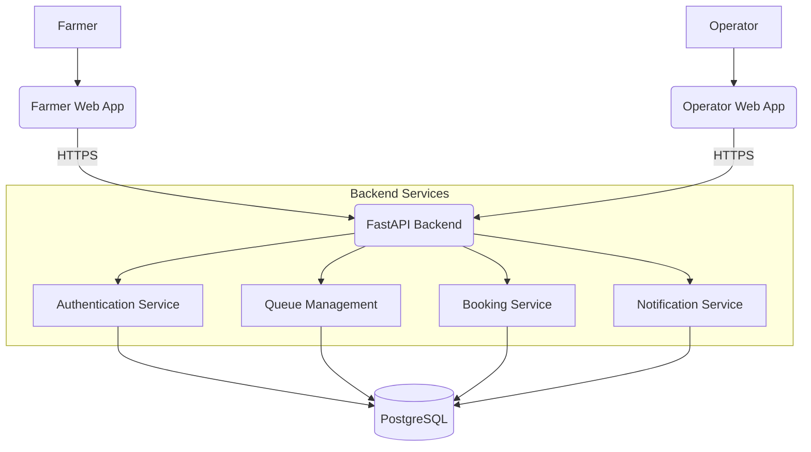

# System Architecture

## Overview
This document covers the system architecture for KisanFlow (Team 151660). 
All claims within this document map directly to evidence in the codebase or project architecture.

## High Level Architecture

## Component Details

### 1. Frontend
- **Framework:** React + Vite
- **Styling:** Tailwind CSS
- **Deployment:** Vercel
- **Status:** 🟢 IMPLEMENTED

### 2. Backend
- **Framework:** Python / FastAPI
- **ORM:** SQLAlchemy with Alembic
- **Status:** 🟢 IMPLEMENTED

### 3. Database
- **Engine:** PostgreSQL
- **Schema Management:** Alembic Migrations
- **Status:** 🟢 IMPLEMENTED

### 4. External Integrations
- **SMS/Notifications:** 🟡 DESIGN / PLANNED
- **Government e-NAM DB Sync:** 🔴 NOT VERIFIED

## Status Mapping
- 🟢 IMPLEMENTED
- 🔵 VERIFIED
- 🟡 DESIGN / PLANNED
- 🟠 PARTIALLY IMPLEMENTED
- 🔴 NOT VERIFIED

---

*Refer to the [Evidence Index](../00_EXECUTIVE_OVERVIEW/EVIDENCE_INDEX.md) for full traceability.*
